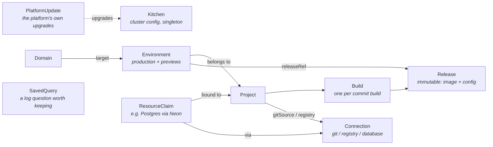

# Kitchen — CRD Schema (draft)

API group: `kitchen.bermos.dev/v1alpha1`.

All Kitchen CRs live in the platform namespace (`kitchen-system`). The operator materializes
workloads (apps/v1 Deployments, Services, HTTPRoutes, Secrets) into per-project namespaces
(`kitchen-<project>`). CRs are the desired state; ClickHouse never holds state, only telemetry.

## Resource overview



The chain is the product: **webhook → Build → Release → Environment → running pods + URL.**
Rollback is just pointing an Environment at an older Release. A preview deployment is just
an Environment with `type: preview` that the operator creates and deletes on PR events.

---

## `Kitchen` (cluster-scoped, singleton)

Platform-wide configuration, editable from the UI (which is why it's a CR and not just Helm
values — Helm installs the operator; the operator owns runtime config).

```yaml
apiVersion: kitchen.bermos.dev/v1alpha1
kind: Kitchen
metadata:
  name: default
spec:
  baseDomain: apps.example.com          # generated URLs: <slug>.apps.example.com
  clusterName: chef                     # what the dashboard's status bar calls this cluster;
                                        # defaults to the first label of baseDomain
  api:
    externalURL: https://kitchen.apps.example.com   # operator API + webhook receiver; defaults to kitchen.<baseDomain>
  ingress:
    gatewayClassName: cilium
    cloudflared:
      enabled: true
      tunnelSecretRef: { name: cloudflared-creds }   # tunnel fronts the Gateway service
  tls:
    mode: cloudflared                   # cloudflared | acme | none
    # mode: acme requires the acme block; the API server refuses the combination
    # without it, rather than admitting a platform whose HTTPS listener has no
    # certificate to terminate with.
    # acme:
    #   email: platform@example.com     # the CA's contact address for this account
    #   server: https://acme-v02.api.letsencrypt.org/directory
    #   dns01:                          # DNS-01 only: the platform needs a wildcard
    #     cloudflare:
    #       apiTokenSecretRef: { name: cloudflare-api-token, key: api-token }
  auth:
    enabled: true                       # the platform's identity provider
    host: auth.apps.example.com         # also the OIDC issuer; defaults to auth.<baseDomain>
    secretRef: { name: kitchen-auth }   # written by the chart; issuer + the operator's registration credential
    previewGate:                        # forward-auth for protected previews
      enabled: true
      host: previews.apps.example.com   # where logins come back to; defaults to previews.<baseDomain>
      replicas: 2
      sessionTTL: 8h
  builds:
    defaultStrategy: auto               # dockerfile | buildpacks | auto (what a project on "auto" takes)
    concurrency: 2
  registry:
    enabled: true                       # the registry the platform runs for itself
    host: registry.apps.example.com     # where it is published; defaults to registry.<baseDomain>
    service: kitchen-registry           # what the route points at, written by the chart
    port: 5000
    secretRef: { name: kitchen-registry }   # written by the chart; the registry's own username and password
  scaleToZero:
    enabled: true                       # off by default; needs KEDA + the HTTP add-on
    interceptor:                        # what an idling environment's URL points at
      service: keda-add-ons-http-interceptor-proxy
      namespace: kitchen-system
      port: 8080
  observability:
    clickhouse:
      retentionDays: 30                 # TTL the operator keeps on every telemetry table,
                                        # the collector's included
      secretRef: { name: kitchen-clickhouse }   # written by the chart; the store's connection details
    hubble:
      relayAddress: hubble-relay.kube-system.svc.cluster.local:80   # flow collection; empty disables it
    metrics:
      enabled: true                     # the operator samples restarts, OOM kills, limits and
      intervalSeconds: 30               # replicas; CPU and memory are the collector's kubelet scrape
    traces:
      enabled: true                     # tell applications where to send their spans
      endpoint: http://kitchen-otlp.kitchen-system.svc.cluster.local:4318   # the collector, and where
                                        # the operator exports its own samples
status:
  conditions: [...]                     # Ready, GatewayProgrammed, TunnelConnected,
                                        # TelemetrySchemaReady, PreviewGateReady, RegistryReady
  gatewayAddress: 203.0.113.7
  registry:
    host: registry.apps.example.com
    connection: kitchen-registry        # the Connection the operator seeded, once
```

`registry` is why a fresh installation can build something without anyone
having a registry account first. The chart runs zot and its volume; the
operator publishes it on the shared Gateway and seeds a `dockerRegistry`
Connection pointing at it, so a new project's registry picker has a working
default.

Publishing it on the base domain rather than reaching it in-cluster is the
whole design. The node's container runtime is what pulls an image, and it
trusts neither an in-cluster CA nor a plain-HTTP address unless the node is
configured to — which is what every other in-cluster registry needs, and
Kitchen is a chart installed into someone else's cluster. The platform's
wildcard certificate is publicly trusted, so a route on it asks the node for
nothing. The costs are stated rather than hidden: pulls leave the cluster and
come back through the Gateway, the registry is reachable from outside (so it
admits nobody anonymously), and in `tls.mode: none` there is no trusted
certificate at all — `RegistryReady` is then False with `TLSModeNone` and
nothing is published.

`status.registry.connection` is written once and read forever after as "this
has been seeded". A Connection someone deletes stays deleted: the seed is a
good default, not a fixture the platform keeps reinstating. While it is still
there and still labelled `app.kubernetes.io/managed-by: kitchen`, its URL and
credential are kept in step with the registry.

`observability` is one retention over a store that two things write. An
OpenTelemetry collector DaemonSet fills the logs, traces and metrics tables
with the stock ClickHouse exporter; the operator fills flows and the activity
feed, and owns the DDL and the TTLs for all of them, including the tables it
never inserts a row into. The exporter runs with `create_schema: false`, so
`retentionDays` moving is still one operator reconcile away from every table,
and the collector on a fresh cluster retries until that reconcile has created
the database.

Both switches govern less than their names suggest, and in opposite
directions. `metrics.enabled` turns the operator's sampler on and off: CPU and
memory come off the kubelet through the collector either way, and what it
decides is whether restarts, OOM kills, resource limits and replica counts are
collected at all. Those are facts about API objects rather than about a
running process, which is why no receiver exposes them — and the restart
differencing has to happen where the previous sample is remembered, because a
lifetime counter bucketed for a chart loses every transition that lands on a
bucket boundary. `traces.enabled` decides whether `traces.endpoint` is
advertised to the environments the operator deploys, through the OTLP
variables every SDK reads; the collector receives either way, and the same
address is where the operator sends its own samples as an ordinary client.

## `Connection` (namespaced: kitchen-system)

A plugin instance. One CRD for all plugin families; `provider` selects the implementation,
`config` is provider-specific (validated by the plugin via webhook).

```yaml
apiVersion: kitchen.bermos.dev/v1alpha1
kind: Connection
metadata:
  name: github-main
spec:
  provider: github                      # github | gitlab | gitea | dockerRegistry | neon | ...
  credentialsSecretRef: { name: github-app-creds }   # synced from Infisical
  config:
    appId: "12345"
    webhookSecretRef: { name: github-webhook-secret }
status:
  conditions: [...]                     # Connected, CredentialsValid
  capabilities: [gitSource, statusChecks]
```

The Connection the operator seeds for the bundled registry is an ordinary one:
`dockerRegistry`, with `config.url` naming the host it publishes and a
credential the platform wrote and never reads back. Nothing downstream treats
it as a special case — it is deletable, replaceable, and pickable exactly like
one someone created on the connections page.

First-party providers: `github` (capabilities `gitSource` and `statusChecks`),
`dockerRegistry` (capability `imageStore`), `neon` (capability `database`). `gitlab` and
`gitea` pass admission and report **no** capabilities: nothing implements them yet, and a
capability nothing can honor would only mislead the matcher. The operator matches on
**capabilities**, not provider names, so CloudNativePG can later implement `database` too.

## `Project` (namespaced: kitchen-system)

The unit a user thinks in: a repo that becomes a running app.

```yaml
apiVersion: kitchen.bermos.dev/v1alpha1
kind: Project
metadata:
  name: my-shop
spec:
  source:
    connectionRef: { name: github-main }
    repo: bermos/my-shop
    productionBranch: main
  build:
    strategy: auto                      # auto takes the Kitchen default; dockerfile | buildpacks decide here
    dockerfilePath: ./Dockerfile        # when strategy: dockerfile
    rootDirectory: ./                   # monorepo support; what buildpacks are pointed at too
  registry:
    connectionRef: { name: harbor }
  previews:
    enabled: true
    protected: true                     # gate preview URLs behind platform login (default)
    ttlAfterClosed: 1h                  # grace period before teardown
  scaleToZero:                          # only does anything where the platform allows it
    mode: previews                      # previews (default) | always | never
    idleAfter: 5m                       # quiet for this long, then no pods at all
    maxReplicas: 5                      # ceiling for a cold-started environment
  env:                                  # env vars with per-environment-type overlay
    - name: DATABASE_URL
      fromResourceClaim: { name: shop-db, key: url }   # injected by claim binding
    - name: PUBLIC_API_BASE
      value: https://api.example.com
      previewValue: https://api-staging.example.com    # previews get this instead
    - name: SESSION_SECRET
      secretRef: { name: shop-secrets, key: session }  # Infisical-synced
  runtime:
    port: 3000                          # omit to take the detected framework's
    replicas: 2                         # previews always get 1
    resources: { cpu: 500m, memory: 512Mi }
status:
  conditions: [...]                     # Ready, SourceConnected, WebhookRegistered
  productionEnvironmentRef: { name: my-shop-production }
  latestBuildRef: { name: my-shop-bld-8f3a2c1 }
```

Reconcile: ensure per-project namespace, register the git webhook via the Connection
(signing secret generated per project), validate that the referenced Connections carry
the required capabilities. The production Environment is created by the first
production-branch Build — an Environment cannot exist before there is a Release to run.

## `Build` (namespaced: kitchen-system)

One build execution for one commit. Created by the webhook handler (or the API for manual
rebuilds). Immutable spec; all the action is in status.

```yaml
apiVersion: kitchen.bermos.dev/v1alpha1
kind: Build
metadata:
  name: my-shop-bld-8f3a2c1
  ownerReferences: [Project my-shop]
spec:
  projectRef: { name: my-shop }
  git:
    sha: 8f3a2c1d...
    branch: feat/checkout
    message: "Add checkout flow"
    author: bermos
    pullRequest: 42                     # unset for direct pushes
status:
  phase: Succeeded                      # Queued | Running | Succeeded | Failed | Cancelled
  detectedFramework: nextjs
  image: harbor.example.com/kitchen/my-shop@sha256:ab12...   # digest, never a tag
  startedAt: ...
  duration: 143s
  conditions: [...]
```

Reconcile: run a build job in the project namespace, push to the registry Connection,
post a status check back on the commit, and on success **create a Release**.
Retention: keep the last N Builds per project (configurable).

Which job that is comes from the strategy. `dockerfile` runs **BuildKit** on the
repository's own Dockerfile, with the commit as a git context BuildKit fetches itself.
`buildpacks` runs the **Cloud Native Buildpacks** lifecycle (`creator`, in Paketo's
jammy builder) over the repository, which needs the source on disk first — so the job
clones the commit in an init container and hands the lifecycle a directory. A buildpacks
build needs none of the privileges a BuildKit one does: it runs as the builder image's
own unprivileged user throughout.

Either builder reports the digest it pushed through the pod's termination message —
BuildKit as JSON metadata, the lifecycle as its TOML report — which is what puts a
digest rather than a tag in `status.image`.

A project on `strategy: auto` takes `Kitchen.spec.builds.defaultStrategy`; when that
is `auto` too, the platform reads the repository at the commit under build and decides
for itself. It lists the build's root directory through the project's git Connection —
no clone, two requests — and matches the first rule that fits: a Dockerfile wins over
everything, then `package.json` and what is in its dependencies (`next`, `nuxt`,
`@sveltejs/kit`, `@remix-run/*`, `@nestjs/core`, `astro`, `react-scripts`, `vite`),
then `go.mod`, `requirements.txt`/`pyproject.toml`/`Pipfile`, `Gemfile`,
`pom.xml`/`build.gradle`, a `.csproj`, and last a bare `index.html`. Whatever it finds
lands in `status.detectedFramework`, and the build page shows it.

A framework that has no server of its own — a Vite or create-react-app bundle, an Astro
site with no adapter, a directory that is already a website — is built into an image
that serves it with NGINX, by telling the lifecycle so (`BP_WEB_SERVER`,
`BP_WEB_SERVER_ROOT`, and the project's own `build` script through
`BP_NODE_RUN_SCRIPTS`).

Two things do not happen. A repository nothing matches **fails the build** with *"no
Dockerfile and no framework detected"* rather than handing a builder a repository it
cannot build; and a repository the platform cannot *read* right now — a provider that is
down, a credential that stopped working — leaves the Build `Queued` with reason
`SourceUnreadable`, because nothing about the commit caused that. Detection runs only
where configuration left the question open: `strategy: dockerfile` never reads the
repository, and `strategy: buildpacks` reads it only to learn what to tell the
lifecycle, building anyway if it cannot.

The job's output reaches ClickHouse the same way every other container's does — the
node's collector tails it — so the build pod is labelled `kitchen.bermos.dev/build`
and kept for an hour after it finishes, long enough for the last lines to ship.

## `Release` (namespaced: kitchen-system)

An immutable snapshot: image digest + the project's config *as it was at build time*.
This is what makes rollback instant and exact — old Releases don't drift when the
Project spec changes later.

> Named `Release`, not `Deployment`, to avoid colliding with `apps/v1 Deployment`
> in every kubectl session and conversation forever.

```yaml
apiVersion: kitchen.bermos.dev/v1alpha1
kind: Release
metadata:
  name: my-shop-rel-000042
  ownerReferences: [Project my-shop]
spec:                                   # fully immutable (enforced by webhook)
  projectRef: { name: my-shop }
  buildRef: { name: my-shop-bld-8f3a2c1 }
  image: harbor.example.com/kitchen/my-shop@sha256:ab12...
  configSnapshot:                       # frozen copy of Project.spec.env + runtime
    env: [...]
    runtime: { port: 3000, resources: {...} }   # port resolved: a project that
                                                # named none gets the detected
                                                # framework's, frozen here
status:
  environments: [my-shop-production, my-shop-pr-42]   # where it's live (informational)
```

## `Environment` (namespaced: kitchen-system)

A running instance of a Release with a URL. Exactly one `production` per Project;
`preview` Environments are created/deleted by the operator from PR events.

```yaml
apiVersion: kitchen.bermos.dev/v1alpha1
kind: Environment
metadata:
  name: my-shop-pr-42
  ownerReferences: [Project my-shop]
spec:
  projectRef: { name: my-shop }
  type: preview                         # production | preview
  releaseRef: { name: my-shop-rel-000042 }   # rollback = edit this line
  preview:
    pullRequest: 42
    branch: feat/checkout
status:
  phase: Live                           # Pending | Deploying | Live | Degraded | Terminating
  url: https://my-shop-pr-42.apps.example.com
  observedRelease: my-shop-rel-000042
  history:                              # how past releases stopped being current,
    - release: my-shop-rel-000041       # newest first, last 10
      from: "2026-08-13T09:12:00Z"      # when it became / stopped being current
      to: "2026-08-14T10:30:00Z"
      reason: promoted                  # promoted | rolledBack | superseded
      by: my-shop-bld-abc123def456-xk2p9   # the promoting Build, or the API caller
  gitReport:                            # what was last posted back to the git provider
    revision: ab12cd34ef56              # absent where nothing is reported to
    state: success                      # in_progress | success | failure | inactive
    url: https://my-shop-pr-42.apps.example.com
    commentID: "204819274"              # the PR comment that is rewritten in place
    error: ""                           # why the last post did not land
    at: "2026-08-14T10:30:04Z"
  conditions: [...]                     # Ready, RouteProgrammed, WorkloadAvailable,
                                        # PreviewProtected (previews only),
                                        # ScaleToZero (where the platform idles anything)
```

`history` answers what `releaseRef` alone cannot: **how** the environment moved off each
release. `promoted` — a fresh build's release was auto-promoted over it; `rolledBack` —
someone moved the environment back to an older release; `superseded` — anything else
replaced it (a manual move forward through the API, or a direct spec edit, where `by`
stays empty).

`gitReport` is bookkeeping for [deploy status](#deploy-status-back-on-the-commit): an
Environment reconciles far more often than it changes, and without a record of what was
already said, every pass would post the same deployment status again. It is also where a
refused post is recorded — never as a condition, because reporting is commentary on a
deployment rather than a part of it.

Reconcile (the heart of the operator): in the project namespace, ensure an apps/v1
Deployment (from the Release's image + config snapshot), Service, `HTTPRoute` attached to
the shared Cilium `Gateway` (host = generated or custom domain), and synced Secrets.
Auto-promotion: a successful Build on `productionBranch` → new Release → the operator
updates the production Environment's `releaseRef`. Preview lifecycle: PR opened →
Environment created; PR closed/merged → deleted after `ttlAfterClosed`.

A preview whose Project has `previews.protected` (the default) is routed through the
platform's forward-auth gate instead of straight at its Service: same HTTPRoute, gate as
the backend, and the application's address in a header the Gateway sets. Anonymous
requests land on the platform login and only signed-in ones reach the application, which
needs no changes — see [AUTH.md](AUTH.md). Production environments are never gated. If
protection is asked for on a platform that runs no gate, the Environment gets **no route
at all** rather than a public one, and says so in `PreviewProtected`.

Where the platform idles environments (`Kitchen.spec.scaleToZero.enabled`) and the
Project's `spec.scaleToZero` covers this type, the reconciler also writes an
`HTTPScaledObject` for it and addresses the application through the KEDA HTTP add-on's
interceptor rather than directly — as the Gateway's backend on an open environment, as
the gate's upstream on a protected one. The workload's replica count then belongs to
KEDA: the reconciler stops writing it, because the number it would write is the one the
autoscaler just moved. Everything that can go wrong here falls back to plain Deployment
routing with the environment's own replicas, and says why in `ScaleToZero` — an
application parked behind an interceptor nothing is watching would never come back.

## `Domain` (namespaced: kitchen-system)

A custom domain attached to an Environment (almost always production).

```yaml
apiVersion: kitchen.bermos.dev/v1alpha1
kind: Domain
metadata:
  name: shop-example-com
spec:
  hostname: shop.example.com
  environmentRef: { name: my-shop-production }
  tls: acme                             # acme | cloudflared | none (inherits Kitchen default)
status:
  verified: true                        # DNS ownership check (TXT or CNAME)
  verification:                         # the exact records that satisfy it
    txtRecord: _kitchen-challenge.shop.example.com
    txtValue: kitchen-verify=…          # derived from the Domain's UID — stable, recomputable
    cnameTarget: my-shop.apps.example.com
  tlsMode: acme                         # the mode in effect after inheritance
  conditions: [...]                     # Verified, CertificateReady, RouteProgrammed
```

Reconcile: prove ownership first — a TXT record at `_kitchen-challenge.<hostname>`
carrying a token derived from the Domain's UID, or a CNAME from the hostname into the
base domain (pointing your name at the platform is the zone owner's own action, and the
record traffic needs anyway). `Verified` distinguishes the real failure modes: record
absent, record present with the wrong value, lookup failed. Once verified it stays
verified — routing must not flap with a record owners typically delete after setup.

What happens next follows the TLS mode in effect (`spec.tls`, or the platform's mode):

- **acme** — a per-hostname cert-manager `Certificate`, issued through the
  `kitchen-acme-http01` ClusterIssuer. HTTP-01 through the shared Gateway, not the
  platform's DNS-01: the Cloudflare token only writes to the base domain's zone, and a
  custom domain's zone is by definition someone else's. Issuance therefore needs the
  hostname to already resolve to the platform. Once the certificate's secret exists,
  the shared Gateway gains an HTTPS listener for the hostname.
- **cloudflared** — a custom hostname is a tunnel ingress rule in Cloudflare's control
  plane, which the token-managed tunnel gives the operator no way to write or read.
  `CertificateReady` is honestly `Unknown` and its message names the manual step.
- **none** — plain HTTP over the shared port-80 listener; no certificate.

The Domain reconciler never writes the Gateway or an HTTPRoute — `KitchenReconciler`
owns the shared Gateway's listeners and `EnvironmentReconciler` each Environment's
route; both watch Domains and include the verified ones. `RouteProgrammed` *observes*
the result: whether the route carries the hostname and the Gateway accepted it on the
listener this domain's traffic uses. Deleting a Domain removes its Certificate and
secret through a finalizer; the listener and hostname disappear because their writers
only ever include live, verified Domains.

## `ResourceClaim` (namespaced: kitchen-system)

A project's request for a provisioned resource from a `database`-capable (or future
capability) Connection. Generic on purpose — this is the plugin abstraction.

```yaml
apiVersion: kitchen.bermos.dev/v1alpha1
kind: ResourceClaim
metadata:
  name: shop-db
spec:
  projectRef: { name: my-shop }
  connectionRef: { name: neon-prod }
  type: postgres
  deletionPolicy: Retain                # Retain (default) | Delete — what deleting the claim does to the data
  config:
    previewBranching: true              # Neon: DB branch per preview Environment
status:
  phase: Bound                          # Pending | Bound | Failed
  secretName: shop-db-binding           # binding keys: url, host, port, user, password, database
  instanceID: proj-abc123               # provider-side ID, opaque; what deprovisioning addresses
  branches:                             # one per preview Environment, with previewBranching
    - environment: my-shop-pr-41
      id: br-def456
      secretName: shop-db-binding-my-shop-pr-41
  conditions: [...]                     # Ready, Provisioned, PreviewBranchesReady
```

Reconcile: require the `database` capability on the Connection (Pending, saying so,
until the Connection reconciler has validated it), provision through the plugin
(`internal/provider/database` — Neon today, generic enough for CloudNativePG), and
write the binding into a Secret in the project namespace, whose keys
`Project.spec.env` reads via `fromResourceClaim`. A provider refusal is phase
`Failed` with the provider's own words in the `Ready` condition. With
`previewBranching`, preview Environments each get their own DB branch and their own
binding Secret (`<claim>-binding-<environment>`), which the Environment's workload
reads instead of the shared one; the claim controller holds a finalizer on each
branched Environment and tears branch and Secret down when the preview goes — that
plus preview URLs is the whole Vercel+Neon flow, self-hosted.

`spec.deletionPolicy` decides what deleting the *claim* does to the provisioned
database: `Retain` (the default) keeps it at the provider, `Delete` deprovisions it
with its data. Retain is the default because a claim can front a production
database — destroying data is opted into, never implied. Branches and binding
Secrets are cleaned up under either policy: they belong to the platform, not to the
data.

---

## `PlatformUpdate` (cluster-scoped)

One attempt to upgrade Kitchen's own Helm release. Cluster-scoped because the thing
it upgrades is: there is one release, and the namespace it lives in is compiled in.
Records are kept after they finish, so the list is the installation's upgrade history.

```yaml
apiVersion: kitchen.bermos.dev/v1alpha1
kind: PlatformUpdate
metadata:
  name: update-0-2-1
spec:
  version: "0.2.1"                      # bare SemVer; the only field there is
status:
  phase: Succeeded                      # Pending | Running | Succeeded | Failed
  fromVersion: "0.2.0"
  jobName: kitchen-self-update-update-0-2-1
  message: the platform is on 0.2.1
  conditions: [...]
```

`spec.version` is deliberately the only field. The Job that runs the upgrade is bound
to cluster-admin, so an update that forwarded caller-supplied helm arguments would be
a way to apply anything at all as cluster-admin — the reconciler builds the whole
invocation itself and reads nothing from here but the version.

Reconcile: preflight (self-update enabled, not a downgrade, not already current, minor
crossing allowed, ServiceAccount present, no other upgrade in flight) → a Job running
`helm upgrade --reset-then-reuse-values --atomic` → phase from the Job's outcome.

The Job exists because the operator cannot run its own upgrade: applying the new
manager Deployment terminates the pod, and helm killed mid-upgrade leaves the release
`pending-upgrade` with no process to finish or roll it back. Everything in status is
therefore derived from the Job, never from what the reconciler remembers — the process
that reports an upgrade succeeded is a different one, usually a different version, from
the one that started it.

Needs `selfUpdate.enabled=true` on the chart; without it every PlatformUpdate is
refused with a message saying so. See the [chart README](../charts/kitchen/README.md#letting-the-platform-update-itself).

---

## `SavedQuery` (namespaced: kitchen-system)

A question about the logs, kept under a name. The observability view carries its whole
selection in the URL, so any question is already a link; this is what makes one
*findable* by someone who was never sent the link.

```yaml
apiVersion: kitchen.bermos.dev/v1alpha1
kind: SavedQuery
metadata:
  name: checkout-500s                   # derived from the title by the API
spec:
  title: Checkout 500s
  description: Errors from the checkout service
  query: "level:error service:shop"     # Kitchen's log query language
  where: ""                             # the ClickHouse escape hatch, if that is what was used
  rangeMinutes: 60                      # relative window; 0 means everything retained
  limit: 500
  view: patterns                        # which tab it is read in: lines | patterns
  includeCluster: false
  savedBy: grace@example.com
```

It has **no status and no reconciler**, and that is the point rather than an omission.
The rule that a write surface waits for its reconciler is about objects that do nothing
until something acts on them — a `Domain` is not routed and a `ResourceClaim` is not
provisioned until their controllers run. A saved query has its whole effect by existing:
reading it back is the feature.

The window is a duration and never an absolute range. "The spike last Tuesday" stops
being a question and becomes a screenshot, and the retention deletes it out from under
its own name.

---

## Deploy status back on the commit

The half of git integration that faces the reviewer. A Connection reporting the
`statusChecks` capability is one the platform posts back through; a Connection without it
is used as a source and nothing more, silently — which is also what a provider that can
be a source but cannot report anything yet gets, since the operator asks for the
reporting half with a type assertion (`gitprovider.StatusReporter`) rather than assuming
every provider has one.

Three things are posted, all keyed so that several Kitchen projects can watch one
repository without overwriting each other:

- **A status check per Build**, in context `kitchen/<project>`: `pending` when the
  BuildKit job starts, `success` when the image is pushed, `failure` when the build
  failed and `error` when the platform could not run it at all. `target_url` is the
  build's page in the dashboard.
- **A deployment per Environment**, named after the Environment, carrying the URL:
  `in_progress` while the workload comes up, `success` once it is available, `inactive`
  when a preview is torn down. Previews are marked transient, production is marked
  production.
- **One comment per preview**, rewritten in place on every push rather than appended to,
  found by an invisible `<!-- kitchen-preview: <environment> -->` marker and thereafter
  by the ID recorded in `status.gitReport`. It states that a protected preview asks an
  anonymous visitor to sign in, because a reviewer who is not a platform user would
  otherwise read the gate as a broken link.

**None of it can fail a deployment.** A revoked token is the Connection reconciler's
business — it probes the credential and turns `CredentialsValid` red — and a build that
produced an image produced it whether or not the provider heard about it. Posting
failures are logged, and for an Environment recorded in `status.gitReport.error`, which
is also what makes the next reconcile retry rather than treat the report as delivered.

## Flows, end to end

**Push to `main`:** webhook → `Build` created → BuildKit job (logs → ClickHouse) →
image pushed → `Release` created → production `Environment.releaseRef` updated →
apps/v1 Deployment rolls → status check goes green on the commit.

**PR opened:** webhook → `Build` for the head SHA → `Release` → operator creates
`Environment` (type `preview`, DB branch if claimed) → HTTPRoute programmed →
PR comment with the preview URL. Every later push to the PR: new Build → new Release →
same Environment's `releaseRef` bumped. PR closed: Environment (and DB branch) torn down.

**Rollback:** `Environment.spec.releaseRef` → previous Release. One field, instant,
exact (config was snapshotted). The UI's rollback button is a one-line patch.

## Conventions

- Every CR uses `metav1.Conditions` in status; the UI reads conditions, not phases,
  for detail (phases are the coarse summary).
- Owner references throughout: deleting a Project cascades to everything.
- Builds/Releases are immutable after creation (validating webhook) and garbage-collected
  by count per project, never by the operator "cleaning up" something an Environment
  still references.
- Cross-references are by name within `kitchen-system` — no cross-namespace refs in v1alpha1.
