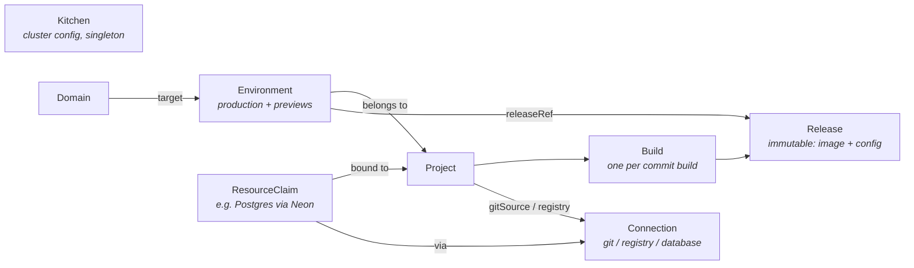

# Kitchen — CRD Schema (draft)

API group: `kitchen.bermos.dev/v1alpha1`.

All Kitchen CRs live in the platform namespace (`kitchen-system`). The operator materializes
workloads (apps/v1 Deployments, Services, HTTPRoutes, Secrets) into per-project namespaces
(`kitchen-<project>`). CRs are the desired state; ClickHouse never holds state, only telemetry.

## Resource overview



The chain is the product: **webhook → Build → Release → Environment → running pods + URL.**
Rollback is just pointing an Environment at an older Release. A preview deployment is just
an Environment with `type: preview` that the operator creates and deletes on PR events.

---

## `Kitchen` (cluster-scoped, singleton)

Platform-wide configuration, editable from the UI (which is why it's a CR and not just Helm
values — Helm installs the operator; the operator owns runtime config).

```yaml
apiVersion: kitchen.bermos.dev/v1alpha1
kind: Kitchen
metadata:
  name: default
spec:
  baseDomain: apps.example.com          # generated URLs: <slug>.apps.example.com
  api:
    externalURL: https://kitchen.apps.example.com   # operator API + webhook receiver; defaults to kitchen.<baseDomain>
  ingress:
    gatewayClassName: cilium
    cloudflared:
      enabled: true
      tunnelSecretRef: { name: cloudflared-creds }   # tunnel fronts the Gateway service
  tls:
    mode: cloudflared                   # cloudflared | acme | none
  auth:
    enabled: true                       # the platform's identity provider
    host: auth.apps.example.com         # also the OIDC issuer; defaults to auth.<baseDomain>
    secretRef: { name: kitchen-auth }   # written by the chart; issuer + the operator's registration credential
    previewGate:                        # forward-auth for protected previews
      enabled: true
      host: previews.apps.example.com   # where logins come back to; defaults to previews.<baseDomain>
      replicas: 2
      sessionTTL: 8h
  builds:
    defaultStrategy: auto               # auto (detect) | dockerfile | buildpacks
    concurrency: 2
  observability:
    clickhouse:
      retentionDays: 30                 # TTL the operator keeps on the telemetry tables
      secretRef: { name: kitchen-clickhouse }   # written by the chart; the store's connection details
status:
  conditions: [...]                     # Ready, GatewayProgrammed, TunnelConnected,
                                        # TelemetrySchemaReady, PreviewGateReady
  gatewayAddress: 203.0.113.7
```

## `Connection` (namespaced: kitchen-system)

A plugin instance. One CRD for all plugin families; `provider` selects the implementation,
`config` is provider-specific (validated by the plugin via webhook).

```yaml
apiVersion: kitchen.bermos.dev/v1alpha1
kind: Connection
metadata:
  name: github-main
spec:
  provider: github                      # github | gitlab | gitea | dockerRegistry | neon | ...
  credentialsSecretRef: { name: github-app-creds }   # synced from Infisical
  config:
    appId: "12345"
    webhookSecretRef: { name: github-webhook-secret }
status:
  conditions: [...]                     # Connected, CredentialsValid
  capabilities: [gitSource, statusChecks]
```

First-party providers: `github`/`gitlab`/`gitea` (capability `gitSource`), `dockerRegistry`
(capability `imageStore`), `neon` (capability `database`). The operator matches on
**capabilities**, not provider names, so CloudNativePG can later implement `database` too.

## `Project` (namespaced: kitchen-system)

The unit a user thinks in: a repo that becomes a running app.

```yaml
apiVersion: kitchen.bermos.dev/v1alpha1
kind: Project
metadata:
  name: my-shop
spec:
  source:
    connectionRef: { name: github-main }
    repo: bermos/my-shop
    productionBranch: main
  build:
    strategy: auto                      # overrides Kitchen default
    dockerfilePath: ./Dockerfile        # when strategy: dockerfile
    rootDirectory: ./                   # monorepo support
  registry:
    connectionRef: { name: harbor }
  previews:
    enabled: true
    protected: true                     # gate preview URLs behind platform login (default)
    ttlAfterClosed: 1h                  # grace period before teardown
  env:                                  # env vars with per-environment-type overlay
    - name: DATABASE_URL
      fromResourceClaim: { name: shop-db, key: url }   # injected by claim binding
    - name: PUBLIC_API_BASE
      value: https://api.example.com
      previewValue: https://api-staging.example.com    # previews get this instead
    - name: SESSION_SECRET
      secretRef: { name: shop-secrets, key: session }  # Infisical-synced
  runtime:
    port: 3000
    replicas: 2                         # previews always get 1
    resources: { cpu: 500m, memory: 512Mi }
status:
  conditions: [...]                     # Ready, SourceConnected, WebhookRegistered
  productionEnvironmentRef: { name: my-shop-production }
  latestBuildRef: { name: my-shop-bld-8f3a2c1 }
```

Reconcile: ensure per-project namespace, register the git webhook via the Connection
(signing secret generated per project), validate that the referenced Connections carry
the required capabilities. The production Environment is created by the first
production-branch Build — an Environment cannot exist before there is a Release to run.

## `Build` (namespaced: kitchen-system)

One build execution for one commit. Created by the webhook handler (or the API for manual
rebuilds). Immutable spec; all the action is in status.

```yaml
apiVersion: kitchen.bermos.dev/v1alpha1
kind: Build
metadata:
  name: my-shop-bld-8f3a2c1
  ownerReferences: [Project my-shop]
spec:
  projectRef: { name: my-shop }
  git:
    sha: 8f3a2c1d...
    branch: feat/checkout
    message: "Add checkout flow"
    author: bermos
    pullRequest: 42                     # unset for direct pushes
status:
  phase: Succeeded                      # Queued | Running | Succeeded | Failed | Cancelled
  detectedFramework: nextjs
  image: harbor.example.com/kitchen/my-shop@sha256:ab12...   # digest, never a tag
  startedAt: ...
  duration: 143s
  conditions: [...]
```

Reconcile: run a BuildKit job in the project namespace, push to the registry Connection,
post a status check back on the commit, and on success **create a Release**.
Retention: keep the last N Builds per project (configurable).

The job's output reaches ClickHouse the same way every other container's does — the
node's collector tails it — so the build pod is labelled `kitchen.bermos.dev/build`
and kept for an hour after it finishes, long enough for the last lines to ship.

## `Release` (namespaced: kitchen-system)

An immutable snapshot: image digest + the project's config *as it was at build time*.
This is what makes rollback instant and exact — old Releases don't drift when the
Project spec changes later.

> Named `Release`, not `Deployment`, to avoid colliding with `apps/v1 Deployment`
> in every kubectl session and conversation forever.

```yaml
apiVersion: kitchen.bermos.dev/v1alpha1
kind: Release
metadata:
  name: my-shop-rel-000042
  ownerReferences: [Project my-shop]
spec:                                   # fully immutable (enforced by webhook)
  projectRef: { name: my-shop }
  buildRef: { name: my-shop-bld-8f3a2c1 }
  image: harbor.example.com/kitchen/my-shop@sha256:ab12...
  configSnapshot:                       # frozen copy of Project.spec.env + runtime
    env: [...]
    runtime: { port: 3000, resources: {...} }
status:
  environments: [my-shop-production, my-shop-pr-42]   # where it's live (informational)
```

## `Environment` (namespaced: kitchen-system)

A running instance of a Release with a URL. Exactly one `production` per Project;
`preview` Environments are created/deleted by the operator from PR events.

```yaml
apiVersion: kitchen.bermos.dev/v1alpha1
kind: Environment
metadata:
  name: my-shop-pr-42
  ownerReferences: [Project my-shop]
spec:
  projectRef: { name: my-shop }
  type: preview                         # production | preview
  releaseRef: { name: my-shop-rel-000042 }   # rollback = edit this line
  preview:
    pullRequest: 42
    branch: feat/checkout
status:
  phase: Live                           # Pending | Deploying | Live | Degraded | Terminating
  url: https://my-shop-pr-42.apps.example.com
  observedRelease: my-shop-rel-000042
  history:                              # how past releases stopped being current,
    - release: my-shop-rel-000041       # newest first, last 10
      from: "2026-08-13T09:12:00Z"      # when it became / stopped being current
      to: "2026-08-14T10:30:00Z"
      reason: promoted                  # promoted | rolledBack | superseded
      by: my-shop-bld-abc123def456-xk2p9   # the promoting Build, or the API caller
  conditions: [...]                     # Ready, RouteProgrammed, WorkloadAvailable,
                                        # PreviewProtected (previews only)
```

`history` answers what `releaseRef` alone cannot: **how** the environment moved off each
release. `promoted` — a fresh build's release was auto-promoted over it; `rolledBack` —
someone moved the environment back to an older release; `superseded` — anything else
replaced it (a manual move forward through the API, or a direct spec edit, where `by`
stays empty).

Reconcile (the heart of the operator): in the project namespace, ensure an apps/v1
Deployment (from the Release's image + config snapshot), Service, `HTTPRoute` attached to
the shared Cilium `Gateway` (host = generated or custom domain), and synced Secrets.
Auto-promotion: a successful Build on `productionBranch` → new Release → the operator
updates the production Environment's `releaseRef`. Preview lifecycle: PR opened →
Environment created; PR closed/merged → deleted after `ttlAfterClosed`.

A preview whose Project has `previews.protected` (the default) is routed through the
platform's forward-auth gate instead of straight at its Service: same HTTPRoute, gate as
the backend, and the application's address in a header the Gateway sets. Anonymous
requests land on the platform login and only signed-in ones reach the application, which
needs no changes — see [AUTH.md](AUTH.md). Production environments are never gated. If
protection is asked for on a platform that runs no gate, the Environment gets **no route
at all** rather than a public one, and says so in `PreviewProtected`.

## `Domain` (namespaced: kitchen-system)

A custom domain attached to an Environment (almost always production).

```yaml
apiVersion: kitchen.bermos.dev/v1alpha1
kind: Domain
metadata:
  name: shop-example-com
spec:
  hostname: shop.example.com
  environmentRef: { name: my-shop-production }
  tls: acme                             # acme | cloudflared | none (inherits Kitchen default)
status:
  verified: true                        # DNS ownership check (TXT or CNAME)
  conditions: [...]                     # Verified, CertificateReady, RouteProgrammed
```

Reconcile: verify DNS, request cert via cert-manager when `tls: acme` (or add a
cloudflared tunnel hostname route), add the hostname to the Environment's HTTPRoute.

## `ResourceClaim` (namespaced: kitchen-system)

A project's request for a provisioned resource from a `database`-capable (or future
capability) Connection. Generic on purpose — this is the plugin abstraction.

```yaml
apiVersion: kitchen.bermos.dev/v1alpha1
kind: ResourceClaim
metadata:
  name: shop-db
spec:
  projectRef: { name: my-shop }
  connectionRef: { name: neon-prod }
  type: postgres
  config:
    previewBranching: true              # Neon: DB branch per preview Environment
status:
  phase: Bound
  secretName: shop-db-binding           # per-environment keys: url, host, password...
  conditions: [...]
```

Reconcile: call the plugin to provision, write bindings into a Secret in the project
namespace, expose keys to `Project.spec.env` via `fromResourceClaim`. With
`previewBranching`, preview Environments each get their own DB branch, cleaned up with
the Environment — that plus preview URLs is the whole Vercel+Neon flow, self-hosted.

---

## Flows, end to end

**Push to `main`:** webhook → `Build` created → BuildKit job (logs → ClickHouse) →
image pushed → `Release` created → production `Environment.releaseRef` updated →
apps/v1 Deployment rolls → status check goes green on the commit.

**PR opened:** webhook → `Build` for the head SHA → `Release` → operator creates
`Environment` (type `preview`, DB branch if claimed) → HTTPRoute programmed →
PR comment with the preview URL. Every later push to the PR: new Build → new Release →
same Environment's `releaseRef` bumped. PR closed: Environment (and DB branch) torn down.

**Rollback:** `Environment.spec.releaseRef` → previous Release. One field, instant,
exact (config was snapshotted). The UI's rollback button is a one-line patch.

## Conventions

- Every CR uses `metav1.Conditions` in status; the UI reads conditions, not phases,
  for detail (phases are the coarse summary).
- Owner references throughout: deleting a Project cascades to everything.
- Builds/Releases are immutable after creation (validating webhook) and garbage-collected
  by count per project, never by the operator "cleaning up" something an Environment
  still references.
- Cross-references are by name within `kitchen-system` — no cross-namespace refs in v1alpha1.
