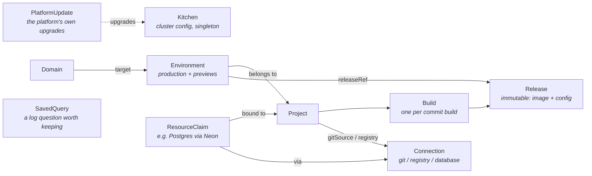

# Kitchen — CRD Schema (draft)

API group: `kitchen.bermos.dev/v1alpha1`.

All Kitchen CRs live in the platform namespace (`kitchen-system`). The operator materializes
workloads (apps/v1 Deployments, Services, HTTPRoutes, Secrets) into per-project namespaces
(`kitchen-<project>`). CRs are the desired state; ClickHouse never holds state, only telemetry.

## Resource overview



The chain is the product: **webhook → Build → Release → Environment → running pods + URL.**
Rollback is just pointing an Environment at an older Release. A preview deployment is just
an Environment with `type: preview` that the operator creates and deletes on PR events.

---

## `Kitchen` (cluster-scoped, singleton)

Platform-wide configuration, editable from the UI (which is why it's a CR and not just Helm
values — Helm installs the operator; the operator owns runtime config).

```yaml
apiVersion: kitchen.bermos.dev/v1alpha1
kind: Kitchen
metadata:
  name: default
spec:
  baseDomain: apps.example.com          # generated URLs: <slug>.apps.example.com
  clusterName: chef                     # what the dashboard's status bar calls this cluster;
                                        # defaults to the first label of baseDomain
  residency: CH                         # where this installation's data is — declared, not observed;
                                        # the compliance inventory's default for environments
  api:
    externalURL: https://kitchen.apps.example.com   # operator API + webhook receiver; defaults to kitchen.<baseDomain>
  ingress:
    gatewayClassName: cilium
    publicAddresses: [85.195.238.240]  # where the internet reaches this platform, when a router
                                       # forwards :80/:443 to a private Gateway address; the only
                                       # thing that reads it is the dns.mismatch signal
    cloudflared:
      enabled: true
      tunnelSecretRef: { name: cloudflared-creds }   # tunnel fronts the Gateway service
  tls:
    mode: cloudflared                   # cloudflared | acme | none
    # mode: acme requires the acme block; the API server refuses the combination
    # without it, rather than admitting a platform whose HTTPS listener has no
    # certificate to terminate with.
    # acme:
    #   email: platform@example.com     # the CA's contact address for this account
    #   server: https://acme-v02.api.letsencrypt.org/directory
    #   dns01:                          # DNS-01 only: the platform needs a wildcard
    #     cloudflare:
    #       apiTokenSecretRef: { name: cloudflare-api-token, key: api-token }
  auth:
    enabled: true                       # the platform's identity provider
    host: auth.apps.example.com         # also the OIDC issuer; defaults to auth.<baseDomain>
    secretRef: { name: kitchen-auth }   # written by the chart; issuer + the operator's registration credential
    databaseSecretRef: { name: kitchen-postgres }  # the accounts database; read by backups alone
    previewGate:                        # forward-auth for protected previews
      enabled: true
      host: previews.apps.example.com   # where logins come back to; defaults to previews.<baseDomain>
      replicas: 2
      sessionTTL: 8h
  access:                               # who may do what with the platform itself
    operators:                          # everything, everywhere, plus admin on every project
      - subject: user_01H8X…            # the issuer's `sub`, or an address — see below
        email: anna@example.com         # informational, so the YAML reads
  builds:
    defaultStrategy: auto               # dockerfile | buildpacks | auto (what a project on "auto" takes)
    concurrency: 2
    cache:
      enabled: true                     # reuse layers between builds, in the registry the project pushes to
      mode: max                         # max | min — how much of a BuildKit build is kept
      scope: project                    # project | branch — what two builds share to reuse each other's layers
  appNamespaces:
    podSecurity: privileged             # privileged | baseline | restricted — the Pod Security level the
                                        # operator labels every kitchen-<project> namespace with. Set rather
                                        # than inherited: rootless BuildKit needs seccomp and AppArmor
                                        # unconfined, which Pod Security admits at privileged alone, and a
                                        # Job whose pods it refuses creates no pod at all — the build sits
                                        # in Running forever. Lower it only where every project builds with
                                        # buildpacks, which ask for neither.
  registry:
    enabled: true                       # the registry the platform runs for itself
    host: registry.apps.example.com     # where it is published; defaults to registry.<baseDomain>
    service: kitchen-registry           # what the route points at, written by the chart
    port: 5000
    secretRef: { name: kitchen-registry }   # written by the chart; the registry's own username and password
  objectStore:
    enabled: false                      # the MinIO the platform can run for itself; off by default
    service: kitchen-objectstore        # the Service every bucket is reached at, written by the chart
    port: 9000
    region: us-east-1                   # what every bucket reports; a formality S3 clients insist on
    secretRef: { name: kitchen-objectstore }   # written by the chart; the store's root access key pair
  scaleToZero:
    enabled: true                       # off by default; needs KEDA + the HTTP add-on
    install: true                       # the operator installs those two itself, as their own releases
    interceptor:                        # what an idling environment's URL points at
      service: keda-add-ons-http-interceptor-proxy
      namespace: kitchen-system
      port: 8080
  databases:
    install: true                       # off by default; the operator installs CloudNativePG itself
    namespace: kitchen-databases        # where provisioned databases live — never a project's namespace
    operatorNamespace: cnpg-system      # where CloudNativePG itself runs
  compliance:
    audit:
      enabled: true                     # append-only, hash-chained record of every state transition
      retentionDays: 365                # its own retention, minimum 90 — evidence outlives telemetry
    attestation:
      enabled: true                     # sign a build record for every artifact, attached to its digest
      signingKeyRef: { name: kitchen-attestation-key }   # unset: the operator generates one, once
      build:
        provenance: true                # ask the builder how it built it — SLSA, from BuildKit
        sbom: true                      # ask the builder what is in it; pulls a scanner every build
        sbomGenerator: ""               # unset: a pinned syft scanner, emitting SPDX 2.3
    machineIdentities:                  # exempt from a project's pull request requirement;
      - renovate[bot]                   # every use of the exemption is an audit record
      - release-please[bot]
    gates:                              # run over every artifact; they record findings, never verdicts
      - name: trivy
        image: aquasec/trivy:0.58.0
        version: "0.58.0"               # what a finding is reproducible against
        format: trivy-json
        args: [image, --format=json, --output=$(KITCHEN_FINDINGS), $(KITCHEN_ARTIFACT)]
    rescan:                             # re-evaluate what is deployed, against today's database
      enabled: false                    # off: it costs a scanner pod per environment per interval
      interval: 24h                     # per (environment, release) pair, from its last finished scan
      concurrency: 4                    # scans in flight across the whole platform
      scanner:                          # matched against the SBOM, never against the image
        name: grype
        image: anchore/grype:v0.87.0
        version: "0.87.0"
        format: grype-json              # grype-json, trivy-json or osv-json
        args: [-o, json, --file, $(KITCHEN_FINDINGS), "sbom:$(KITCHEN_SBOM)"]
        timeoutSeconds: 900
  retention:                            # how long each class is kept; absent = inherit
    containerLogs: 14                   # empty inherits observability.clickhouse.retentionDays,
    buildLogs: 180                      # as flows, metrics, traces, requests, clusterEvents
    audit: 365                          # and activity do; audit inherits compliance.audit.retentionDays
    auditFloorOverride:                 # the only way under the 90-day floor, and an audit record
      reason: demonstration cluster; holds no production data at all
      approvedBy: cto@example.com
  observability:
    clickhouse:
      retentionDays: 30                 # the retention every telemetry class inherits when
                                        # spec.retention does not set it
      secretRef: { name: kitchen-clickhouse }   # written by the chart; the store's connection details
    hubble:
      relayAddress: hubble-relay.kube-system.svc.cluster.local:80   # flow collection; empty disables it
    metrics:
      enabled: true                     # the operator samples restarts, OOM kills, limits and
      intervalSeconds: 30               # replicas; CPU and memory are the collector's kubelet scrape
    traces:
      enabled: true                     # tell applications where to send their spans
      endpoint: http://kitchen-otlp.kitchen-system.svc.cluster.local:4318   # the collector, and where
                                        # the operator exports its own samples
    clockSync:
      enabled: true                     # do the clocks that stamp all of this agree with each other?
      maxDriftSeconds: 5                # measured off the kubelet node leases; drift beyond this is
                                        # an unhealthy `clock-sync` entry in status.components
status:
  conditions: [...]                     # Ready, GatewayProgrammed, TunnelConnected,
                                        # TelemetrySchemaReady, PreviewGateReady, RegistryReady,
                                        # ObjectStoreReady, ScaleToZeroReady, DatabasesReady,
                                        # ComplianceReady
  gatewayAddress: 203.0.113.7
  registry:
    host: registry.apps.example.com
    connection: kitchen-registry        # the Connection the operator seeded, once
  objectStore:
    endpoint: http://kitchen-objectstore.kitchen-system.svc.cluster.local:9000
    connection: kitchen-objectstore     # the Connection the operator seeded, once
  scaleToZero:
    managed: true                       # false or absent: KEDA was already there and is nobody's to touch
    namespace: keda
    version: 2.20.2                     # what the operator installed, and may upgrade
    addOnVersion: 0.15.0
  databases:
    managed: true                       # false: CloudNativePG was already there and is nobody's to touch
    namespace: cnpg-system
    version: 0.29.0                     # the chart the operator installed, and may upgrade
  compliance:
    audit:
      recording: true                   # false with a message when there is nowhere to append to
      sequence: 1428                    # where the chain ends, published outside the table
    attestation:
      signing: true
      keyID: 9f2c...                    # SHA-256 of the public key's DER encoding
      secretName: kitchen-attestation-key
    rescan:
      running: true                     # false with a message: off, no scanner, or nothing to sign with
      lastSweep: 2026-08-24T03:14:00Z
      environments: 42                  # deployed pairs the last pass considered
      scanning: 4                       # how many had a scan in flight when it finished
  retention:
    lastSweep: 2026-08-24T03:00:00Z
    auditFloorOverridden: false
    classes:
      - class: containerLogs
        days: 14
        source: retention               # or the legacy field this class inherits from
        enforced: true                  # false until a sweep has measured it
        rows: 41203311
        oldest: 2026-08-10T04:11:02Z    # the claim the rule makes: nothing older than this
        expired: 0                      # rows still past the horizon; a small number is normal
  clockSync:
    checked: 2026-08-24T09:00:00Z
    method: kubelet node lease renewTime, compared with the operator's own clock
    nodes: 3
    drifted: 0
    maxDriftSeconds: 5
    worstNode: node-b
    worstDriftMillis: 42
```

The dependencies the operator installs that the chart cannot are **Addons**,
one object each, and neither is a field here any more. KEDA's HTTP add-on ships
a `ScaledObject` of KEDA's own CRD, and Helm validates a release's whole
manifest before applying any of it; CloudNativePG ships CRDs and an admission
webhook of its own and is a popular thing for a cluster to already run, and
Helm will not adopt a release another one owns. A platform that owns its
cluster should not answer "install this yourself first" to "give me a
database", and an operator is under none of Helm's constraints — so it installs
one release, waits, and installs the next, as a job under an account the chart
creates only when asked (`scaleToZero.install.enabled`,
`databases.install.enabled`), because it is bound to cluster-admin.

What is left on the singleton is `scaleToZero.enabled` — whether environments
idle at all, which stays meaningful in a cluster somebody else installed KEDA
into — and `databases.namespace`, where provisioned databases go. The two
`Ready` conditions stay too, as roll-ups of the Addons' own, because "can this
cluster idle an environment" and "can it provision a database" are facts about
the cluster everything downstream already asks.

`status.managed` on an Addon is what keeps an install a seed rather than a
takeover: it is written only when the operator's own install job succeeded, and
a cluster already serving the entry's API is recorded with it false and never
written to again. What it decides for CloudNativePG is narrower than for KEDA:
who may *upgrade* it, not who may use it. A `cnpg` connection provisions into
whichever CloudNativePG the cluster runs, whoever installed it.

The `managed` flag is *re-derived* on every reconcile rather than remembered
from the one that installed. The install job is what says the platform
installed a dependency — it is the operator's own, it carries the chart
versions and namespace it installed as labels, and it outlives the reconcile
that read it — so a status write that does not land costs a pass rather than
the ownership of a release. It used to cost the ownership: the record was
minted once, and a platform that had lost it read the cluster as somebody
else's, said so emphatically, and never upgraded the release it had made
itself.

`registry` is why a fresh installation can build something without anyone
having a registry account first. The chart runs zot and its volume; the
operator publishes it on the shared Gateway and seeds a `dockerRegistry`
Connection pointing at it, so a new project's registry picker has a working
default.

Publishing it on the base domain rather than reaching it in-cluster is the
whole design. The node's container runtime is what pulls an image, and it
trusts neither an in-cluster CA nor a plain-HTTP address unless the node is
configured to — which is what every other in-cluster registry needs, and
Kitchen is a chart installed into someone else's cluster. The platform's
wildcard certificate is publicly trusted, so a route on it asks the node for
nothing. The costs are stated rather than hidden: pulls leave the cluster and
come back through the Gateway, the registry is reachable from outside (so it
admits nobody anonymously), and in `tls.mode: none` there is no trusted
certificate at all — `RegistryReady` is then False with `TLSModeNone` and
nothing is published.

`status.registry.connection` is written once and read forever after as "this
has been seeded". A Connection someone deletes stays deleted: the seed is a
good default, not a fixture the platform keeps reinstating. While it is still
there and still labelled `app.kubernetes.io/managed-by: kitchen`, its URL and
credential are kept in step with the registry.

`objectStore` is the same shape with the route left out. The chart runs a
single MinIO with a volume when its `objectStore.enabled` is set, and the
operator seeds an `s3` Connection (`kitchen-objectstore`) pointing at its
Service, with the root credential the chart generated once. There is no
route because nothing outside the cluster needs one: an application runs in
the cluster and reaches the store at its Service address, and the node's
container runtime — the reason the registry needs a publicly trusted
certificate — is not in the path. The corollary is that a bucket in it cannot
be publicly readable, and a claim asking for that is refused with the reason.
The seeded Connection is written with `forcePathStyle: true` (MinIO needs
it), `inCluster: true` (what refuses the public bucket), and the default
`scopedCredentials`, so every claim's bucket gets a user and a policy of its
own minted from the root credential; no application is ever handed the root.
`status.objectStore.connection` is a seed on the registry's terms: deleted,
it stays deleted.

`access.operators` is the platform role, and the only one there is: an account
on the list is an operator — everything, everywhere, and project `admin` on
every project, present and future — and every other account is a member, which
has no platform surface at all, sees what project membership grants it, and
may create projects. It lives on this object because this object is already
the platform's configuration and is already edited through `PATCH /settings`,
so granting somebody the operator hat needs no new store and no kubectl.

It is the one field here with no `{}` default, deliberately. The others have
one so that an installation predating them still gets the feature; here the
absence carries information. **No `access` block at all means nobody has ever
said who the operators are** — an installation upgrading into enforcement,
where every account can call every route today and so every account read
honestly *is* an operator, and the list is seeded from the accounts that
exist. **An empty list means somebody narrowed it to nobody on purpose**, and
is left exactly as it is. A default would collapse the two on the first write
and lock an upgraded installation out of its own platform. See
[AUTH.md](AUTH.md#bootstrap-and-what-happens-on-upgrade).

The entries name accounts the same way a Project's grants do, minus the role —
`subject` plus an informational `email` — and the rule for what `subject` may
hold is the same one, described under `Project` below.

Seeding reads the account directory the bundled identity provider serves, and
**an installation federated to an issuer of its own has none**: OpenID Connect
defines no way to enumerate accounts, so on a Keycloak or an Auth0 nothing is
ever seeded, nobody holds the operator role, and every operator-only route
refuses everybody — including the `PATCH /settings` that would name an
operator. Such an installation names its operators at install time, through
the chart value `kitchen.access.operators`, which renders into this field; a
list the chart wrote is a list somebody wrote, and is never re-seeded over.
The `OperatorsConfigured` condition distinguishes the three: `OperatorsSeeded`
and `OperatorsNamed` say who holds the role, `NoAccountDirectory` says this
issuer serves none and names the value to set, and `DirectoryUnavailable` says
one that should have answered did not, and is retried.

The chart writes this field only on install, and on an upgrade with
`kitchen.applyOnUpgrade=true`, where it carries the live list across rather
than dropping it — the singleton is a Helm hook that is deleted and recreated,
and a recreated object with the field absent would be re-seeded from every
account that exists.

`compliance` is the platform's own evidence, and it is on the singleton rather
than on a Project deliberately: a team that could turn its own audit log off,
or sign its own evidence with a key it chose, would be attesting to nothing.
The audit log is a hash-chained table in the telemetry store with a retention
of its own — telemetry ages out in weeks and the evidence an incident is
reconstructed from must not go with it. Attestation signs a build record for
every artifact and attaches it to the artifact's digest as a DSSE envelope
over an in-toto statement, through OCI referrers, so the evidence is readable
by anything that speaks those and by nothing that has to speak Kitchen. Both
report on `status.compliance`, because the failure mode of evidence is
silence: an installation that believes it is producing evidence and is not
should find that out from the platform rather than from an auditor.

`compliance.rescan` is the same argument extended in time. A gate scans an
artifact on the day it is built and a promotion judges that scan on the day it
is promoted; both were true when they were made, and neither is a statement
about what is running today. The rescan pass walks every currently-deployed
release on `interval`, matches the bill of materials the build already
attested against a **current** vulnerability database, signs the result onto
the artifact's digest and re-runs the environment's own bar over it — through
the same evaluator a promotion uses, so the two cannot disagree. It needs no
rebuild and no redeploy, because the image is never pulled. It is also the
only thing that judges exception expiry, and the only thing that acts on an
Exception's `autoRollback`. `status.compliance.rescan` reports whether it is
running at all, for the same reason the other two report: an installation
that believes it is being re-checked and is not should hear it from the
platform. See [COMPLIANCE.md](COMPLIANCE.md) §9.

`observability` is one retention over a store that two things write. An
OpenTelemetry collector DaemonSet fills the logs, traces and metrics tables
with the stock ClickHouse exporter; the operator fills flows and the activity
feed, and owns the DDL and the TTLs for all of them, including the tables it
never inserts a row into. The exporter runs with `create_schema: false`, so
`retentionDays` moving is still one operator reconcile away from every table,
and the collector on a fresh cluster retries until that reconcile has created
the database.

Both switches govern less than their names suggest, and in opposite
directions. `metrics.enabled` turns the operator's sampler on and off: CPU and
memory come off the kubelet through the collector either way, and what it
decides is whether restarts, OOM kills, resource limits and replica counts are
collected at all. Those are facts about API objects rather than about a
running process, which is why no receiver exposes them — and the restart
differencing has to happen where the previous sample is remembered, because a
lifetime counter bucketed for a chart loses every transition that lands on a
bucket boundary. `traces.enabled` decides whether `traces.endpoint` is
advertised to the environments the operator deploys, through the OTLP
variables every SDK reads; the collector receives either way, and the same
address is where the operator sends its own samples as an ordinary client.

## `Connection` (namespaced: kitchen-system)

A plugin instance. One CRD for all plugin families; `provider` selects the implementation,
`config` is provider-specific (validated by the plugin via webhook).

```yaml
apiVersion: kitchen.bermos.dev/v1alpha1
kind: Connection
metadata:
  name: github-main
spec:
  provider: github                      # github | gitlab | gitea | dockerRegistry | neon | cnpg | s3 | inngest
  credentialsSecretRef: { name: github-app-creds }   # synced from Infisical
  config:
    appId: "12345"
    webhookSecretRef: { name: github-webhook-secret }
status:
  conditions: [...]                     # Connected, CredentialsValid
  capabilities: [gitSource, statusChecks]
```

The Connection the operator seeds for the bundled registry is an ordinary one:
`dockerRegistry`, with `config.url` naming the host it publishes and a
credential the platform wrote and never reads back. Nothing downstream treats
it as a special case — it is deletable, replaceable, and pickable exactly like
one someone created on the connections page.

First-party providers: `github`, `gitlab` and `gitea` (capabilities `gitSource` and
`statusChecks`), `dockerRegistry` (capability `imageStore`), two that
implement `database` — `neon` for a hosted Postgres and `cnpg` for one this
cluster runs itself — and `s3` (capability `objectStore`) for any
S3-compatible store: the bundled MinIO, one a team runs, AWS S3, Cloudflare
R2. The operator matches on **capabilities**, not provider names, which is
why the second database provider cost the claim nothing.

An `s3` connection's `credentialsSecretRef` names a Secret with `accessKeyId`
and `secretAccessKey`; its `config` says where the store is and how it is
talked to — `endpoint`, `region`, `forcePathStyle`, and `scopedCredentials`,
which is whether the platform mints a user and a policy per bucket through
the MinIO admin API (the default) or hands every claim the connection's own
key pair (S3 and R2, which have no such API). The seeded one for the bundled
store additionally carries `inCluster: true`, which is what refuses a
publicly readable bucket: there is no public to read it.
`inngest` (capability `backgroundJobs`) is an Inngest Cloud account an
`inngest` claim reads its keys from.

**`cnpg` is the one provider with no credential**, and so the one whose
`credentialsSecretRef` may be left out: it provisions with the operator's own
service account, into the cluster Kitchen is installed in, and there is
nothing for anybody to store or rotate. A CEL rule on the spec keeps that the
exception — every other provider is still refused without one, and a `cnpg`
connection naming one is refused for naming a credential nothing reads. Its
`Connected` condition is a fact about this cluster rather than about a remote
API: true when `postgresql.cnpg.io` is served, false with the install
instruction when it is not.

Its `config` is the operator's own defaults for every claim through it, and
the whole of it is optional:

```yaml
spec:
  provider: cnpg
  config:
    namespace: kitchen-databases        # where the databases live; default is the singleton's
    storageSize: 20Gi                   # what a claim that names no size gets
    storageClass: fast-ssd              # default: the cluster's own default StorageClass
    instances: 1                        # Postgres instances per database
    images:                             # replaces the platform's catalogue entirely
      - repository: registry.internal/postgres
        majors: ["16", "17"]
        extensions: [timescaledb]       # what this image promises; claims are refused against it
```

`images` is the operator's and not the claim's on purpose: a developer asking
for an extension should not be able to choose the image it arrives in.

## `Project` (namespaced: kitchen-system)

The unit a user thinks in: a repo that becomes a running app.

```yaml
apiVersion: kitchen.bermos.dev/v1alpha1
kind: Project
metadata:
  name: my-shop
spec:
  source:
    connectionRef: { name: github-main }
    repo: bermos/my-shop
    productionBranch: main
    requirePullRequest: false           # refuse a production commit the provider cannot say was
                                        # reviewed. Preview builds are unaffected; machine
                                        # identities on the platform's allowlist are exempt
  build:
    strategy: auto                      # auto takes the Kitchen default; dockerfile | buildpacks decide here
    dockerfilePath: ./Dockerfile        # when strategy: dockerfile
    rootDirectory: ./                   # monorepo support; what buildpacks are pointed at too
  registry:
    connectionRef: { name: harbor }
  previews:
    enabled: true
    protected: true                     # gate preview URLs behind platform login (default)
    ttlAfterClosed: 1h                  # grace period before teardown
  dataClass: confidential               # public | internal | confidential | strictlyConfidential;
                                        # absent = unclassified, shown as such and never defaulted.
                                        # Claims narrow it, environments must be rated at least it
  scaleToZero:                          # only does anything where the platform allows it
    mode: previews                      # previews (default) | always | never; overridden
                                        # by runtime.notRequestDriven below
    idleAfter: 5m                       # quiet for this long, then no pods at all
    maxReplicas: 5                      # ceiling for a cold-started environment
  access:                               # who may do what with this project
    - subject: user_01H8X…              # the issuer's `sub`, or an address — see below
      email: anna@example.com           # informational, so the YAML reads
      role: developer                   # admin | developer | viewer
  env:                                  # env vars with per-environment-type overlay
    - name: DATABASE_URL
      fromResourceClaim: { name: shop-db, key: url }   # injected by claim binding
    - name: PUBLIC_API_BASE
      value: https://api.example.com
      previewValue: https://api-staging.example.com    # previews get this instead
    - name: SESSION_SECRET
      secretRef: { name: shop-secrets, key: session }  # Infisical-synced
  runtime:
    port: 3000                          # omit to take the detected framework's
    replicas: 2                         # previews always get 1
    notRequestDriven: false             # does work nobody asked for, so nothing of
                                        # this project idles — previews included
    singleton: false                    # two of this must never run at once:
                                        # strategy Recreate, and replicas > 1 refused
    command: [./server]                 # replaces the image's entrypoint; exec
    args: [--config=prod.toml]          # form, a list of words, never a shell line
    previewArgs: [--config=fake.toml]   # used instead of args in previews, the way
                                        # an env var's previewValue replaces its value
    resources: { cpu: 500m, memory: 512Mi }
    health:                             # what the platform asks before it sends
      path: /healthz                    # anyone to a new pod. No path = a TCP
      port: 9000                        # connect to the port above, never GET /
      periodSeconds: 10                 # every environment is probed either way
      timeoutSeconds: 2
      failureThreshold: 3               # a running pod out of service
      startupFailureThreshold: 30       # x period = how long it has to come up
  processes:                            # what it runs *besides* the web process
    - name: worker                      # a Deployment with no Service, no route
      type: worker
      command: [node, worker.js]
      replicas: 2
      singleton: false                  # two of this worker must never run at
                                        # once: Recreate, and replicas > 1 refused
      health: { port: 9000 }            # opt-in here, and it must name the port
    - name: nightly-report              # a batch/v1 CronJob; one firing is a run
      type: cron
      schedule: "0 3 * * *"             # five fields, read in UTC
      command: [node, report.js]
      timeout: 30m                      # becomes activeDeadlineSeconds
      concurrencyPolicy: Forbid         # Allow | Forbid | Replace
      previews: false                   # the default, and a decision
status:
  conditions: [...]                     # Ready, SourceConnected, RegistryConnected,
                                        # WebhookRegistered, InitialBuild
  productionEnvironmentRef: { name: my-shop-production }
  latestBuildRef: { name: my-shop-bld-8f3a2c1 }
  initialBuildRef: { name: my-shop-bld-8f3a2c1 }   # the build the platform made
                                        # itself, once, when the project was new
```

`initialBuildRef` is what makes a new project deploy without waiting for a
push: the reconciler resolves the production branch's tip and creates one
Build of it as soon as both connections are usable, and records it here so it
is never done twice. The `InitialBuild` condition carries why it has not
happened yet when it has not.

Two of those reasons look alike and are not. `NoCommit` — an empty repository,
or a production branch that is not there — is the project's own configuration
meeting the repository, and asking again changes nothing, so the project is
left alone until somebody pushes or corrects the branch; it is still a ready
project. `RepositoryUnreadable` is the opposite: what has to change is a
credential held at the provider — a token's repository access, an app
installation, a secret somebody replaced — and none of that is something the
platform can watch happen. So the project keeps asking, every 30 seconds,
until the repository answers; it also reports `Ready=False` with that reason
meanwhile, because a project whose source nothing can read is not going to
build. Both are how a credential fixed at the provider reaches the platform on
its own rather than waiting for something to write to the Project.

The project's Connections are watched for the same reason: a connection whose
capabilities or credential verdict has just changed enqueues every project
bound to it, source and registry alike. The Build and Environment watches
cannot cover that case — a project that has never built has neither.

`access` is the project's membership, and it is the whole of the answer: an
account with no entry holds no role here at all, so the project is not in
their list and not theirs to build, redeploy or read. `admin` adds membership,
the project's own settings and deleting it to what a `developer` may do;
`viewer` reads status, URLs, builds, releases and logs, and may open a
protected preview. The one account that needs no entry is a platform operator,
who holds `admin` on every project — that rule lives in exactly one place in
the code, so a project's list can never lock one out. Membership is here,
rather than in the identity provider or in a token claim, because a role
carried in a token is a snapshot good for as long as the token is: removing
somebody would leave them on the project for up to an hour, and removal is the
case where that delay matters most. See
[AUTH.md](AUTH.md#where-membership-lives).

The list merges per `subject` rather than by position, so an apply that adds
one person cannot drop another. `subject` is normally the issuer's `sub`,
which is opaque — the dashboard resolves an address to one when it writes a
grant, and `email` beside it is informational, so that a list of opaque
strings still reads. Hand-written YAML may name an address in `subject`
instead, and the rule telling the two apart is blunt on purpose: **a subject
containing `@` is read as an email address**, matched case-insensitively, and
honoured only for a token whose `email_verified` claim is true. An unverified
address is something the token holder said about themselves, so an
unverified-email grant is a grant to whoever can get the identity provider to
let them type that address — it resolves to no role rather than to the one
written down.

`processes` is what the project runs besides its web process, and there is
deliberately no `web` entry: the web process is `runtime` above, singular
because the URL is — an Environment publishes one hostname, one Service and
one route, and a second process claiming to be the web one would have to be
told which of those it got. A `worker` runs continuously and is never
addressed; a `cron` runs on its schedule and each firing is a Job. Both share
the Release's image and resolved environment and differ only in how they are
started, which is why this is a field rather than a second build.

`previews` is `false` unless a process asks otherwise, for both types alike. A
preview shares the project's environment variables, so a preview that emails
customers nightly is a bad afternoon and a preview worker draining the
production queue is a worse one. The list merges per `name`, so two people
adding two workers do not drop each other's.

`runtime.notRequestDriven` is a workload that does work nobody asked for, and
it turns idling off for every environment of the Project — previews included,
which is where it matters, since previews idle by default. Scale to zero is
request-driven by construction: the interceptor brings an environment back on
the next request to its URL, and there is no request for a background loop.
Parked, it stops, and the hole that leaves in whatever it was collecting is
indistinguishable from the upstream having been down. It lives on the runtime
because it describes what the workload *is*, but the idling decision reads the
Project's live value rather than the Release's frozen copy, for the same
reason `scaleToZero` is not snapshotted at all: a rollback must not quietly
start parking an environment again.

`runtime.singleton` is the *web* workload two of which must never run at once.
It becomes `strategy: Recreate` on the Deployment — the old pod stops before the
new one starts — and a CEL rule on the CRD **refuses** `replicas` above one
rather than clamping it, because a clamped value reads back as a setting that
did not take. For a stateless web application none of this is needed, which is
why the default is a rolling update; for one with a poller, a scheduler or an
ingest loop in the same binary as the web server, the few seconds a rolling
update overlaps two pods are that loop running twice against a shared store.
Leader election stays the application's problem; not overlapping it during a
deploy the platform initiated is the platform's.

A worker says the same thing on its own entry, with `processes[].singleton`,
and it reads exactly the same way: `strategy: Recreate` on that worker's
Deployment, `replicas` above one refused rather than clamped. It is there
because the web process is the one that least needed it — a poller moved out
of the web binary into a worker, which is the arrangement that makes the web
process safely scalable, would otherwise take the API server's default rolling
update, and at one replica that surges to a second copy and takes none away.
One replica does not imply the declaration: a queue consumer at one replica is
usually fine overlapping, and inferring the constraint from the count would
make the count mean two things. A `cron` process is refused it — whether two
of its runs may overlap is `concurrencyPolicy`, whose default is `Forbid`.

`runtime.command` and `runtime.args` start the application container, the same
two fields a process has and in the same exec form. `previewArgs` replaces
`args` in a preview: same commit, same artifact, different flags — which is
the point, since the artifact is built once and never rebuilt, so a preview
that needs a fake data source cannot get one by building a second image. An
empty `previewArgs` is no override, the reading an empty `previewValue` gets
too. All three are in the snapshot, so a rollback restores the arguments the
release ran with.

`runtime.health` is how the platform finds out whether an application is
*working* rather than merely started, and it is the reason `status.phase:
Live` means anything: the phase is the Deployment's availability, which is its
ready replicas, which is the readiness probe. Every environment gets three
probes — startup, readiness, and, where a `path` is declared, liveness. With
no path the check is a TCP connect to the container port: a weaker claim than
an HTTP 200, and a much better one than asserting a readiness nothing
established. `GET /` is deliberately not the default, since plenty of
applications answer it before they are ready and one that 404s there would
never become Ready at all. The startup threshold is separate from the liveness
one because slow startup is a legitimate state and a threshold loose enough to
tolerate it is too loose to catch a wedge afterwards.

A process's `health` is opt-in and has to name its `port`, both refused at
admission rather than ignored: a worker publishes no port to fall back on, and
a scheduled run's verdict is its exit status, so the field is refused on a
`cron` process outright.

Reconcile: ensure per-project namespace, register the git webhook via the Connection
(signing secret generated per project), validate that the referenced Connections carry
the required capabilities. The production Environment is created by the first
production-branch Build — an Environment cannot exist before there is a Release to run.

## `Build` (namespaced: kitchen-system)

One build execution for one commit. Created by the webhook handler (or the API for manual
rebuilds). Immutable spec; all the action is in status.

```yaml
apiVersion: kitchen.bermos.dev/v1alpha1
kind: Build
metadata:
  name: my-shop-bld-8f3a2c1
  ownerReferences: [Project my-shop]
spec:
  projectRef: { name: my-shop }
  git:
    sha: 8f3a2c1d...
    branch: feat/checkout
    message: "Add checkout flow"
    author: bermos
    pullRequest: 42                     # unset for direct pushes
status:
  phase: Succeeded                      # Queued | Running | Succeeded | Failed | Cancelled
  detectedFramework: nextjs
  config:                               # the commit's own kitchen.json, when it carried one
    path: kitchen.json                  # relative to the repository root
    build: { strategy: dockerfile }     # only the keys the file actually set
    runtime: { port: 3000 }
    env: [{ name: NODE_ENV, value: production }]
  image: harbor.example.com/kitchen/my-shop@sha256:ab12...   # digest, never a tag
  artifact:
    repository: harbor.example.com/kitchen/my-shop
    digest: sha256:ab12...              # the identity everything downstream keys on
    attestedAt: ...                     # when the platform attached its build record
    keyID: 9f2c...                      # what it was signed under
    evidence:                           # an index of what is attached, not a copy of it
      - predicateType: https://kitchen.bermos.dev/attestation/build-record/v1
        source: platform                # the reconciler's account of the build
        manifest: sha256:7c30...
      - predicateType: https://slsa.dev/provenance/v1
        source: builder                 # BuildKit's own, countersigned by the platform
        manifest: sha256:7c30...
      - predicateType: https://spdx.dev/Document
        source: builder
        manifest: sha256:7c30...
    message: ""                         # why it is unattested, when it is
  source:                               # how the commit reached the branch, as the provider tells it
    provider: github                    # whose claim this is; the platform did not watch the review
    pullRequest: 42
    title: Add checkout flow
    author: alice                       # opened it
    mergedBy: bob
    approvers: [bob]                    # approvals that still stood when this was asked
    selfApproved: false                 # recorded separately: a self-approval is an approval
    independent: true                   # somebody other than the author approved
    required: true                      # the project asked for this, so "none" would mean something
    checkedAt: ...
  cache:
    enabled: true
    warm: true                          # the cache existed when this build started
    ref: harbor.example.com/kitchen/my-shop:buildcache
    mode: max                           # empty for a buildpacks build
    message: ""                         # why there was no cache, when there was none
  gates:                                # what each gate did — not what it found
    - name: trivy
      phase: Completed                  # it ran. Whether what it found is acceptable is a
      source: platform                  # policy question about the environment, answered at promotion
      predicateType: https://kitchen.bermos.dev/attestation/quality-gate/v1
      attested: ...
      finishedAt: ...
  startedAt: ...
  duration: 143s
  conditions: [...]
```

Reconcile: run a build job in the project namespace, push to the registry Connection,
post a status check back on the commit, and on success **create a Release**.
Retention: keep the last N Builds per project (configurable).

Which job that is comes from the strategy. `dockerfile` runs **BuildKit** on the
repository's own Dockerfile, with the commit as a git context BuildKit fetches itself.
`buildpacks` runs the **Cloud Native Buildpacks** lifecycle (`creator`, in Paketo's
jammy builder) over the repository, which needs the source on disk first — so the job
clones the commit in an init container and hands the lifecycle a directory. A buildpacks
build needs none of the privileges a BuildKit one does: it runs as the builder image's
own unprivileged user throughout.

Either builder reports the digest it pushed through the pod's termination message —
BuildKit as JSON metadata, the lifecycle as its TOML report — which is what puts a
digest rather than a tag in `status.image`.

`status.artifact` is that digest as an identity rather than as a string, and what
the platform has asserted about it. On success the reconciler signs a build record —
project, commit, strategy, framework, times — and attaches it to the digest through
OCI referrers, under Kitchen's own predicate type rather than SLSA's, because a
reconciler's account of a build it orchestrated is a weaker claim than provenance
from the builder itself. Failing to attest does not fail the build: the image is real
and the deployment that follows is honest about what it is running. What an unattested
artifact cannot do is satisfy a policy that requires evidence, which is where the
consequence belongs.

The builder is asked for two more, which the reconciler cannot make on its own:
**SLSA provenance** — the source commit BuildKit actually resolved, the base images it
actually pulled and their digests, and what it was invoked with — and an **SBOM** of the
finished image. BuildKit leaves both unsigned in an index beside the image; the
reconciler harvests them, restates each about the artifact's digest, and signs them
under the platform's key. `status.artifact.evidence[].source` says which claims are the
builder's and which the platform's, because the signature on both is the same one.

Asked for attestations, BuildKit pushes an index rather than a bare manifest and reports
*its* digest — but the statements inside are about the image manifest, so that is what
`status.artifact.digest` and the Release name. Only the Dockerfile strategy produces
provenance: the buildpacks lifecycle is not BuildKit and emits none, and minting one from
the reconciler's own knowledge would be the conflation the split exists to prevent.

`status.artifact.evidence` is an index — predicate types and the manifests to fetch them
by — and not a copy: the attestations live in the registry against the digest, which is
the only copy an installation leaving Kitchen would keep.

`status.source` is how the commit reached the branch, as the git provider tells it —
which pull request it arrived through, who opened it, and whose approvals still stood
when the platform asked. It is resolved **before the Job is created**, so a project with
`source.requirePullRequest` set refuses an unreviewed production commit before spending
any compute; the Build stays, with reason `SourceUnreviewed`, because refusing without a
record would be the platform quietly dropping changes. The provider is asked rather than
the commit read, because a squash merge produces a commit that names neither the request
nor the approver. Preview builds are never asked to prove they were reviewed: they are
what produces the thing being reviewed. A provider that cannot be reached is recorded as
a check that could not be made and does not refuse anything.

`status.gates` is what the platform's **quality gates** did. Each is a pod: an image
somebody else wrote, pointed at the artifact, writing findings to a file that a second
container stores in the registry and the operator signs. They run after the build is
terminal, so they hold nothing up, and they record **findings and never a verdict** —
`Completed` means the gate ran, whatever it found, and `Failed` means it did not run at
all. Whether findings are disqualifying is a property of the environment being promoted
to. Results produced elsewhere are ingested through `POST /builds/{name}/gates` and
carry who reported them, because a scan somebody submitted is a claim about an artifact
and a claim about who said so. See [COMPLIANCE.md](COMPLIANCE.md).

`status.cache` is what the layer cache did, and it is on every build including the
ones that had none. The cache lives in the registry the project already pushes to,
under the same credential: BuildKit exports a cache manifest to
`<image repository>:buildcache` and imports it on the next build, and the buildpacks
lifecycle exports a cache image to `:buildcache-cnb` — different tags, because the
two formats cannot read each other. `Kitchen.spec.builds.cache` configures all of it:
`mode: max` keeps the intermediate layers, so a source change still reuses the
dependency install above it, and `scope: branch` gives each branch its own cache
instead of one per project.

What is recorded is what the platform can stand behind. `warm` says the cache existed
when the build started; nothing says how many layers were reused, because neither
builder reports it. A cold build says so on the commit status too — "image built and
pushed in 4m12s, cache cold" — so that a slow first build does not read as a
regression.

Two things follow from the cache being a tag in the registry. Whether a registry
accepts a cache manifest cannot be asked, only attempted: BuildKit is told
`ignore-error=true`, so a registry that refuses one warns instead of failing a build
whose image is already pushed, and the reconciler notices on the *next* build — the
last build exported and the cache is not there — and builds that one without a cache,
saying so on `status.cache.message`. That is deliberately not sticky: the build after
tries again, so an installation that moves to a registry which does keep caches
recovers on its own. And the default scope is bounded without anything pruning it —
one tag per project, overwritten in place, so what grows is the unreferenced blobs
underneath, which the bundled registry reclaims while running. `scope: branch` is not
bounded: it leaves one tag per branch that ever built, which nothing removes, and is
the setting to weigh against the registry's own retention.

A project on `strategy: auto` takes `Kitchen.spec.builds.defaultStrategy`; when that
is `auto` too, the platform reads the repository at the commit under build and decides
for itself. It lists the build's root directory through the project's git Connection —
no clone, two requests — and matches the first rule that fits: a Dockerfile wins over
everything, then `package.json` and what is in its dependencies (`next`, `nuxt`,
`@sveltejs/kit`, `@remix-run/*`, `@nestjs/core`, `astro`, `react-scripts`, `vite`),
then `go.mod`, `requirements.txt`/`pyproject.toml`/`Pipfile`, `Gemfile`,
`pom.xml`/`build.gradle`, a `.csproj`, and last a bare `index.html`. Whatever it finds
lands in `status.detectedFramework`, and the build page shows it.

A framework that has no server of its own — a Vite or create-react-app bundle, an Astro
site with no adapter, a directory that is already a website — is built into an image
that serves it with NGINX, by telling the lifecycle so (`BP_WEB_SERVER`,
`BP_WEB_SERVER_ROOT`, and the project's own `build` script through
`BP_NODE_RUN_SCRIPTS`).

Two things do not happen. A repository nothing matches **fails the build** with *"no
Dockerfile and no framework detected"* rather than handing a builder a repository it
cannot build; and a repository the platform cannot *read* right now — a provider that is
down, a credential that stopped working — leaves the Build `Queued` with reason
`SourceUnreadable`, because nothing about the commit caused that. A repository that
cannot be read *at all* — it is not there, or the connection's credential may not see it
— is neither: it fails with reason `RepositoryUnreadable`, saying so, because it is not
going to appear because a Build waited, and because nothing was read for a verdict about
a directory to be about. Detection runs only
where configuration left the question open: `strategy: dockerfile` never reads the
repository, and `strategy: buildpacks` reads it only to learn what to tell the
lifecycle, building anyway if it cannot.

Beside detection, and independently of it, the build reads the commit's own
`kitchen.json` — one more request, made whatever the strategy is, from the project's
root directory. What it declares lands on `status.config`, and what it declares wins:
the strategy and the Dockerfile it names configure the build Job, and its runtime,
variables and processes are merged over the project's into the Release this build
writes. So a rollback replays the configuration its commit declared rather than
today's, and a build of an old commit builds it the way that commit asked. The file
is recorded on the Build before the Job exists, because it is read once and applied
twice — a later reconcile writes the Release, and re-reading the repository there
would spend a second request answering a question that has an answer, and answer it
differently if the branch moved underneath. A file that is *wrong* fails the build
with reason `ConfigInvalid`; one that cannot be read parks it exactly as detection
does. What it may and may not say is [docs/CONFIG.md](CONFIG.md).

The job's output reaches ClickHouse the same way every other container's does — the
node's collector tails it — so the build pod is labelled `kitchen.bermos.dev/build`
and kept for an hour after it finishes, long enough for the last lines to ship.

## `Release` (namespaced: kitchen-system)

An immutable snapshot: image digest + the project's config *as it was at build time*.
This is what makes rollback instant and exact — old Releases don't drift when the
Project spec changes later.

> Named `Release`, not `Deployment`, to avoid colliding with `apps/v1 Deployment`
> in every kubectl session and conversation forever.

```yaml
apiVersion: kitchen.bermos.dev/v1alpha1
kind: Release
metadata:
  name: my-shop-rel-000042
  ownerReferences: [Project my-shop]
spec:                                   # fully immutable (CEL rule on the CRD)
  projectRef: { name: my-shop }
  buildRef: { name: my-shop-bld-8f3a2c1 }
  image: harbor.example.com/kitchen/my-shop@sha256:ab12...
  configSnapshot:                       # frozen copy of Project.spec.env,
    env: [...]                          # runtime and processes
    runtime: { port: 3000, resources: {...} }   # port resolved: a project that
                                                # named none gets the detected
                                                # framework's, frozen here
    processes: [...]                    # the workers and scheduled jobs as they
                                        # stood at build time
status:
  environments: [my-shop-production, my-shop-pr-42]   # where it's live (informational)
```

Immutability is a CEL transition rule (`self == oldSelf`) on the CRD, not a webhook:
the platform ships no admission webhook of its own, and the rule is stronger than one
anyway — an edit is refused by the API server before it is ever written, with the
message `Release spec is immutable`. A snapshot that could be edited afterwards would
not be a snapshot, and instant rollback would stop being exact, which is the whole
justification for the kind.

Reconcile: **maintain `status.environments`** by watching Environments and mapping each
back to the Release it references. The relationship is only declared in the other
direction (`Environment.spec.releaseRef`), so without this, answering "which release is
production on?" means listing every Environment and matching refs by hand. It is
informational and eventually consistent by design.

Retention: keep the newest `Kitchen.spec.builds.releaseRetention` Releases per project
(10 by default; `0` keeps every one). A Release an Environment still points at is kept
on top of that count however old it is — an environment parked on release 3 while forty
more were built still has release 3 to roll back to. The image the pruned Release named
is left in the registry: reclaiming that needs a per-provider delete API and a count of
what else shares the digest.

## `Promotion` (namespaced: kitchen-system)

One request to move one Release into one Environment, with the evaluated decision on
its status. It is how an artifact travels a project's staged pipeline
(`Project.spec.promotion.stages`): the same image digest at every stage, never rebuilt,
judged at each boundary by that environment's `spec.requirements` through the policy
engine. Rollback is the same request at an older Release.

```yaml
apiVersion: kitchen.bermos.dev/v1alpha1
kind: Promotion
metadata:
  name: my-shop-promo-1a2b3c4d5e
spec:                                   # fully immutable (CEL rule, like Release)
  projectRef: { name: my-shop }
  environmentRef: { name: my-shop-production }
  releaseRef: { name: my-shop-rel-000042 }
  requestedBy: anna@example.com         # or system:controller/build, system:controller/promotion
  trigger: manual                       # manual | automatic
  reason: ship 1.4                      # optional; lands in the audit record
status:
  phase: Blocked                        # Pending|Evaluating|Allowed|AllowedWithException|Blocked|Applied|Failed
  verdict: blocked                      # allowed | allowed-with-exception | blocked — exactly three
  decisionID: 0d9a1f7e-…                # the stored decision: fired rules, replayable input
  unmetRules: [require-sbom]            # the fired, unwaived rules by stable id
  message: "blocked by bundle sha256:…: require-sbom (the artifact carries no…)"
```

The reconciler resolves the three references (they must tell one story — a mismatch is
`Failed`), materializes the policy input from the artifact's stored evidence, evaluates
through `internal/policy`, records the decision — audit record fail-closed, decision
store, `promotion-decision` attestation on the artifact — and only when allowed flips
`Environment.spec.releaseRef`, mints the `deployment/v1` attestation, and chains the
next stage's Promotion where `autoPromote` says so. `Blocked` and `Failed` are terminal
because the spec is immutable: a retry is a new Promotion, and the old one stays as the
record of what was refused and why. An environment with no `requirements` accepts
anything — the build controller then skips the Promotion entirely and flips the
Environment directly, exactly the pre-pipeline behaviour; previews are never routed
through a Promotion at all (the preview is the review vehicle).

## `Environment` (namespaced: kitchen-system)

A running instance of a Release with a URL. Exactly one `production` per Project;
`preview` Environments are created/deleted by the operator from PR events.

```yaml
apiVersion: kitchen.bermos.dev/v1alpha1
kind: Environment
metadata:
  name: my-shop-pr-42
  ownerReferences: [Project my-shop]
spec:
  projectRef: { name: my-shop }
  type: preview                         # production | preview
  releaseRef: { name: my-shop-rel-000042 }   # rollback = edit this line
  preview:
    pullRequest: 42
    branch: feat/checkout
  dataClass: internal                   # ceiling this environment is rated to hold — the promotion
                                        # rule refuses a project classified above it; absent = unrated
  residency: CH                         # declared location of its data; absent inherits
                                        # Kitchen.spec.residency in the compliance inventory
status:
  phase: Live                           # Pending | Deploying | Live | Degraded | Terminating
  url: https://my-shop-pr-42.apps.example.com
  observedRelease: my-shop-rel-000042
  history:                              # how past releases stopped being current,
    - release: my-shop-rel-000041       # newest first, last 10
      from: "2026-08-13T09:12:00Z"      # when it became / stopped being current
      to: "2026-08-14T10:30:00Z"
      reason: promoted                  # promoted | rolledBack | superseded
      by: my-shop-bld-abc123def456-xk2p9   # the promoting Build, or the API caller
  gitReport:                            # what was last posted back to the git provider
    revision: ab12cd34ef56              # absent where nothing is reported to
    state: success                      # in_progress | success | failure | inactive
    url: https://my-shop-pr-42.apps.example.com
    commentID: "204819274"              # the PR comment that is rewritten in place
    error: ""                           # why the last post did not land
    at: "2026-08-14T10:30:04Z"
  rescan:                               # what the continuous re-evaluation pass last found
    phase: Evaluated                    # Scanning | Evaluated | Failed — Failed is "nothing is
    release: my-shop-rel-000042         # known", never "it found problems"
    artifact: registry.apps.example.com/my-shop@sha256:...
    jobName: my-shop-pr-42-scan-my-shop-rel-000042
    startedAt: "2026-08-24T03:14:00Z"
    finishedAt: "2026-08-24T03:16:11Z"  # the interval is counted from this
    dataSnapshot: grype-db:sha256:...   # which vulnerability database; `unpinned:` = dated, not
    findings: 41                        # reproducible
    verdict: blocked                    # allowed | allowed-with-exception | blocked
    unmetRules: [max-severity]
    decisionID: 0d9a1f7e-...            # the stored decision, with the whole input
    message: blocked by bundle sha256:...
  processes:                            # the workers and scheduled jobs, as last seen
    - name: worker
      type: worker
      workload: my-shop-pr-42-worker    # the Deployment or CronJob it materialized as
      replicas: 2
      readyReplicas: 2
    - name: nightly-report
      type: cron
      workload: my-shop-production-nightly-report
      schedule: "0 3 * * *"
      suspended: false                  # true on a preview that did not opt in
      active: 0                         # runs in flight
      lastRun:                          # whatever it did
        name: my-shop-production-nightly-report-29387520
        phase: Failed                   # Running | Succeeded | Failed
        startedAt: "2026-08-24T03:00:04Z"
        finishedAt: "2026-08-24T03:00:37Z"
        message: "BackoffLimitExceeded: Job has reached the specified backoff limit"
      lastFailure: {...}                # the most recent one that failed
  conditions: [...]                     # Ready, RouteProgrammed, WorkloadAvailable,
                                        # PreviewProtected (previews only),
                                        # ScaleToZero (where the platform idles anything)
```

`history` answers what `releaseRef` alone cannot: **how** the environment moved off each
release. `promoted` — a fresh build's release was auto-promoted over it; `rolledBack` —
someone moved the environment back to an older release; `superseded` — anything else
replaced it (a manual move forward through the API, or a direct spec edit, where `by`
stays empty).

`rescan` is both the answer and the working state of the continuous
re-evaluation pass: it is where the sweep reads its next move, which is what
lets the sweep itself be stateless between passes and the interval be counted
per pair rather than platform-wide. A release move clears it — the answer was
about the artifact that was running, and carrying it forward would report a
scan that never happened. `GET /compliance/drift` is the same information
across the estate, joined to what was decided at promotion.

`processes` is why a scheduled job that stopped working is something a person
trips over rather than something they have to go and check. `lastFailure` is
kept until a **later failure** replaces it, never until a success does: a job
that fails four nights in five would otherwise read as healthy on the fifth,
and a `CronJob` whose pods fail silently is the classic way the feature
disappoints. Every terminal run also lands in the activity feed as
`run.succeeded` or `run.failed`, naming the process and the run.

`gitReport` is bookkeeping for [deploy status](#deploy-status-back-on-the-commit): an
Environment reconciles far more often than it changes, and without a record of what was
already said, every pass would post the same deployment status again. It is also where a
refused post is recorded — never as a condition, because reporting is commentary on a
deployment rather than a part of it.

Reconcile (the heart of the operator): in the project namespace, ensure an apps/v1
Deployment (from the Release's image + config snapshot), Service, `HTTPRoute` attached to
the shared Cilium `Gateway` (host = generated or custom domain), and synced Secrets.
Auto-promotion: a successful Build on `productionBranch` → new Release → the operator
updates the production Environment's `releaseRef`. Preview lifecycle: PR opened →
Environment created; PR closed/merged → deleted after `ttlAfterClosed`.

A preview whose Project has `previews.protected` (the default) is routed through the
platform's forward-auth gate instead of straight at its Service: same HTTPRoute, gate as
the backend, and the application's address in a header the Gateway sets. Anonymous
requests land on the platform login and only signed-in ones reach the application, which
needs no changes — see [AUTH.md](AUTH.md). Production environments are never gated. If
protection is asked for on a platform that runs no gate, the Environment gets **no route
at all** rather than a public one, and says so in `PreviewProtected`.

The same pass materializes the Release's `processes`: a **worker** becomes a
plain Deployment named `<environment>-<process>` with no Service and no route —
nothing addresses it, so there is nothing to publish and no certificate to
want — and a **cron** becomes a `batch/v1` CronJob of the same name, with the
process's schedule in UTC, its concurrency policy, and its timeout as
`activeDeadlineSeconds`. Both get the Release's image, the environment's
resolved variables, the registry pull secret the web process uses and one
variable of their own, `KITCHEN_PROCESS`: a single image serving three roles
has no other way of telling which one it is.

A run is not retried. `backoffLimit` is zero and the restart policy is `Never`,
so a scheduled run that failed is a failed run and the schedule is what tries
again; the platform keeps the last three successful runs and the last five
failed ones so a person can look at what happened. Everything a process
materializes carries `kitchen.bermos.dev/process`, which is how the pruning
finds what a Release no longer declares (the web process's own Deployment
carries no such label and so can never be caught by it) and how the collector
keys the log store — beside `kitchen.run`, which it lifts off the Job name the
Job controller stamps on every pod. A preview materializes only the processes
that opted in; the rest are reported `suspended` rather than silently dropped.

Where the platform idles environments (`Kitchen.spec.scaleToZero.enabled`), the
Project has not declared its workload `notRequestDriven`, and the Project's
`spec.scaleToZero` covers this type, the reconciler also writes an
`HTTPScaledObject` for it and addresses the application through the KEDA HTTP add-on's
interceptor rather than directly — as the Gateway's backend on an open environment, as
the gate's upstream on a protected one. The workload's replica count then belongs to
KEDA: the reconciler stops writing it, because the number it would write is the one the
autoscaler just moved. Everything that can go wrong here falls back to plain Deployment
routing with the environment's own replicas, and says why in `ScaleToZero` — an
application parked behind an interceptor nothing is watching would never come back.
`ScaleToZero` is also where an environment that does not idle says which of the
reasons applies: `NotRequestDriven` for a workload that does work nobody asked for,
`AlwaysOn` for a mode that simply does not cover this type.

## `Domain` (namespaced: kitchen-system)

A custom domain attached to an Environment (almost always production).

```yaml
apiVersion: kitchen.bermos.dev/v1alpha1
kind: Domain
metadata:
  name: shop-example-com
spec:
  hostname: shop.example.com
  environmentRef: { name: my-shop-production }
  tls: acme                             # acme | cloudflared | none (inherits Kitchen default)
status:
  verified: true                        # DNS ownership check (TXT or CNAME)
  verification:                         # the exact records that satisfy it
    txtRecord: _kitchen-challenge.shop.example.com
    txtValue: kitchen-verify=…          # derived from the Domain's UID — stable, recomputable
    cnameTarget: my-shop.apps.example.com
  tlsMode: acme                         # the mode in effect after inheritance
  conditions: [...]                     # Verified, CertificateReady, RouteProgrammed
```

Reconcile: prove ownership first — a TXT record at `_kitchen-challenge.<hostname>`
carrying a token derived from the Domain's UID, or a CNAME from the hostname into the
base domain (pointing your name at the platform is the zone owner's own action, and the
record traffic needs anyway). `Verified` distinguishes the real failure modes: record
absent, record present with the wrong value, lookup failed. Once verified it stays
verified — routing must not flap with a record owners typically delete after setup.

What happens next follows the TLS mode in effect (`spec.tls`, or the platform's mode):

- **acme** — a per-hostname cert-manager `Certificate`, issued through the
  `kitchen-acme-http01` ClusterIssuer. HTTP-01 through the shared Gateway, not the
  platform's DNS-01: the Cloudflare token only writes to the base domain's zone, and a
  custom domain's zone is by definition someone else's. Issuance therefore needs the
  hostname to already resolve to the platform. Once the certificate's secret exists,
  the shared Gateway gains an HTTPS listener for the hostname.
- **cloudflared** — a custom hostname is a tunnel ingress rule in Cloudflare's control
  plane, which the token-managed tunnel gives the operator no way to write or read.
  `CertificateReady` is honestly `Unknown` and its message names the manual step.
- **none** — plain HTTP over the shared port-80 listener; no certificate.

The Domain reconciler never writes the Gateway or an HTTPRoute — `KitchenReconciler`
owns the shared Gateway's listeners and `EnvironmentReconciler` each Environment's
route; both watch Domains and include the verified ones. `RouteProgrammed` *observes*
the result: whether the route carries the hostname and the Gateway accepted it on the
listener this domain's traffic uses. Deleting a Domain removes its Certificate and
secret through a finalizer; the listener and hostname disappear because their writers
only ever include live, verified Domains.

## `ResourceClaim` (namespaced: kitchen-system)

A project's request for something the platform provisions: a database from a
`database`-capable Connection, a bucket from an `objectStore`-capable one, an
OAuth client from the platform's own identity provider, or a persistent volume
from the cluster's StorageClass. Generic on purpose — this is the plugin
abstraction.
OAuth client from the platform's own identity provider, or durable background
work from a `backgroundJobs`-capable one. Generic on purpose — this is the
plugin abstraction.
`database`-capable Connection, an OAuth client from the platform's own
identity provider, or the keys a worker connects to Inngest with from a
`backgroundJobs`-capable one. Generic on purpose — this is the plugin abstraction.

```yaml
apiVersion: kitchen.bermos.dev/v1alpha1
kind: ResourceClaim
metadata:
  name: shop-db
spec:
  projectRef: { name: my-shop }
  connectionRef: { name: neon-prod }
  type: postgres
  deletionPolicy: Retain                # Retain (default) | Delete — what deleting the claim does to the data
  dataClass: confidential               # never above the project's class; absent = unclassified
  config:
    previewMode: fresh                  # what previews get: the provider's declared mode (default), shared or none
    postgres:                           # what the database itself has to be; all of it optional
      version: "17"                     # major version; empty takes the platform's default
      extensions: [postgis, vector]     # created at bootstrap; unsuppliable ones fail the claim
      storage:
        size: 40Gi
        storageClass: fast-ssd
status:
  phase: Bound                          # Pending | Bound | Failed
  secretName: shop-db-binding           # binding keys: url, host, port, user, password, database
  instanceID: proj-abc123               # provider-side ID, opaque; what deprovisioning addresses
  dataProvenance: production            # the provider's declaration: production | masked | synthetic;
                                        # absent = undeclared, treated by policy as the worst case
  residency: aws-eu-central-1           # where the provider reported the resource actually is
  previewMode: fresh                    # what previews bind to, resolved: branch | fresh | shared | none
  previewReason: a new, empty database… # the provider's own words, or why previews get nothing
  branches:                             # one per preview Environment, under branch or fresh
    - environment: my-shop-pr-41
      id: br-def456
      secretName: shop-db-binding-my-shop-pr-41
      provenance: production            # a branch of a production database is production-derived
  conditions: [...]                     # Ready, Provisioned, PreviewBranchesReady
```

Reconcile: require the `database` capability on the Connection (Pending, saying so,
until the Connection reconciler has validated it), provision through the plugin
(`internal/provider/database` — Neon, or CloudNativePG in this cluster), and
write the binding into a Secret in the project namespace, whose keys
`Project.spec.env` reads via `fromResourceClaim`. A provider refusal is phase
`Failed` with the provider's own words in the `Ready` condition. Under a
preview mode of `branch` or `fresh` — the provider's declaration, and the
default — preview Environments each get their own database and their own
binding Secret (`<claim>-binding-<environment>`), which the Environment's workload
reads instead of the shared one; the claim controller holds a finalizer on each
branched Environment and tears database and Secret down when the preview goes — that
plus preview URLs is the whole Vercel+Neon flow, self-hosted. `previewMode:
shared` binds previews to production's own database, and has to be asked for by
name; `none` binds them to nothing, and the Environment says so rather than
failing. `status.keepsPodsRunning` and `status.forcesRecreate` are the
provider's declarations about the workload, which the Environment reconciler
acts on. [docs/api/claims.md](api/claims.md) carries the matrix.

**`config.postgres` is the claim saying which Postgres it means**, because
"Postgres" is not one thing: an application that needs PostGIS, pgvector or a
time-series extension otherwise binds, gets a URL, and dies on a
`CREATE EXTENSION` in its first migration. The provisioner resolves the version
and the extensions to an image *before* it creates anything, and a claim it
cannot satisfy is phase `Failed` with a message naming what could not be
supplied and what is available instead — the refusal is the feature. Extensions
are created in the database at bootstrap, as superuser, so the application
never needs the right to create them itself. Everything in the block is applied
when the database is created and is not reapplied to a running one: a major
version is not something to change under a live Postgres, and asking for a
different database means asking for a different database.

**`config.inngest` names an Inngest app rather than creating one.** An
`inngest` claim, through a `backgroundJobs`-capable Connection holding an
Inngest Cloud API key, binds the keys a connect worker dials Inngest with:
`INNGEST_EVENT_KEY`, `INNGEST_SIGNING_KEY`, `INNGEST_ENV` and
`INNGEST_BASE_URL`, read from the account on every reconcile (Inngest's API
lists keys and mints none, so an environment with no event key is phase
`Failed` saying where to create one). `app` is the ID the application's
Inngest client is created with — the app registers itself when the worker
first connects, and the `AppConnected` condition reports whether one has —
`environment` is the Inngest environment production binds to (`production`
by default), and `mode` is `connect`, the only one provisioned: serve mode
would have Inngest call the application and meet the preview gate. Previews
each get an Inngest branch environment, found or created by name, bound
through the account's shared branch keys plus `INNGEST_ENV`, and archived
(never deleted) with the preview. The type refuses a `deletionPolicy` — an
app holds no data the platform could destroy — and declares
`keepsPodsRunning`: the worker's outbound WebSocket never crosses the
interceptor, so every environment of the project keeps its pods, and the
`ConnectWorkers` condition counts them against Inngest's per-account cap (3
worker connections on the free plan, 20 on paid), which the API does not
expose.

A provider that cannot be asked any of this — a hosted one — refuses the claim
rather than provisioning it as though the block had not been written down.

**Preview databases are empty, and the claim says so.** CloudNativePG has no
copy-on-write branch, and its nearest equivalent is a `pg_basebackup` of
production, which is slow, doubles the storage and puts production data in a
preview environment. A preview's database inherits the parent's image,
extensions and storage and none of its data, so its branch entry declares
`provenance: synthetic` — which keeps production data out of previews by
construction rather than by policy. Neon's copy-on-write branch declares
`production`, because it is the parent's data under a new address.

`spec.deletionPolicy` decides what deleting the *claim* does to the provisioned
database: `Retain` (the default) keeps it at the provider, `Delete` deprovisions it
with its data. Retain is the default because a claim can front a production
database — destroying data is opted into, never implied. Branches and binding
Secrets are cleaned up under either policy: they belong to the platform, not to the
data.

For a database with a volume behind it, that reads concretely. `Delete` deletes
the CloudNativePG `Cluster`, and cnpg garbage-collects its PVCs with it —
the data is gone. `Retain` leaves the `Cluster` running in the platform's
database namespace, still holding its volume and still costing whatever the
volume costs; a claim of the same name created later against the same
connection finds it by name and rebinds to it. That namespace is deliberately
*not* the project's application namespace: deleting a project deletes that one,
and a retained database has to survive exactly that.

### `type: objectStore` — a bucket for what the application writes

The third type: somewhere to put a file the application did not build into
its image — user uploads, generated exports — instead of the container
filesystem, which loses it on the next deploy. It provisions through an
`objectStore`-capable Connection (`s3`), and the binding is the six things an
S3 client needs:

```yaml
apiVersion: kitchen.bermos.dev/v1alpha1
kind: ResourceClaim
metadata:
  name: shop-uploads
spec:
  projectRef: { name: my-shop }
  connectionRef: { name: kitchen-objectstore }
  type: objectStore
  deletionPolicy: Retain                # Retain (default) | Delete — the bucket and its objects
  config:
    objectStore:                        # all of it optional; applied when the bucket is created
      versioning: true                  # keep every version of an object
      publicRead: false                 # anyone may read — refused by the bundled store, which nothing outside reaches
      size: 50Gi                        # a hard quota at a MinIO; refused at a store with no admin API
status:
  phase: Bound
  secretName: shop-uploads-binding      # binding keys: endpoint, bucket, region, accessKeyId, secretAccessKey, forcePathStyle
  instanceID: kitchen-shop-uploads      # the bucket's name at the store, which is what it is found again by
  dataProvenance: production
  previewMode: fresh                    # every preview gets an empty bucket of its own
  branches:
    - environment: my-shop-pr-41
      id: kitchen-shop-uploads-my-shop-pr-41
      secretName: shop-uploads-binding-my-shop-pr-41
      provenance: synthetic             # an empty bucket never held production objects
```

**A bucket per claim with a credential scoped to it**, never a prefix in a
shared bucket — a prefix is not an isolation boundary. Where the store speaks
the MinIO admin API the provisioner mints a user and a policy per bucket, the
policy reaching the one bucket's objects and nothing about the bucket itself;
the store's own credential is what mints them and is never in a binding. A
preview's bucket is its own — shaped like the parent (versioned when it is),
empty, with its own user — and goes with the preview under either deletion
policy, exactly as a database branch does. `Retain` leaves the claim's own
bucket, its objects and its user at the store; `Delete` removes all three.

`forcePathStyle` is the one binding key worth a sentence: MinIO addresses a
bucket in the path and AWS in the host name, and an application that guesses
wrong fails on every request. It is set on the Connection once and carried in
every binding.

The requirements are typed for the same reason `config.postgres` is: a
provider reads each one and either honours it or refuses the claim *before*
creating anything, with the reason on the `Ready` condition. The bundled
store refuses `publicRead` because it is reached inside the cluster alone; a
store without the admin API refuses `size` because a quota is set through it;
a store that does not implement versioning refuses `versioning`.

### The provider contract: declaring what the data is

Production-derived data in a preview environment is the finding an auditor
reaches first, and the platform closes it off by defining the provider
*contract* rather than any particular provider. A provisioner implements
`database.Provisioner` (`internal/provider/database`): four idempotent verbs —
`Provision`, `Deprovision`, `CreateBranch`, `DeleteBranch` — whose results
carry the compliance half of the contract:

- **`Provenance`** on the returned `Instance`/`Branch` declares what the data
  derives from: `production`, `masked` or `synthetic`. Empty means the
  provisioner cannot say — *undeclared* — and undeclared claims are usable
  only where policy would accept production data: the default bundle's
  `data-provenance-preview` rule refuses both in a preview, so a provisioner
  that cannot declare cannot back an environment that requires a class.
- **`Region`** on the `Instance` reports where the provider actually placed
  the resource, in its own vocabulary. Reported, not declared: it becomes
  `status.residency`, the placement of record.

Neon, the provisioner that ships, declares `production` for both verbs: a
claim's Neon project *is* the production database, and a copy-on-write branch
is the parent's data under a preview's address — cheap to make does not make
it not production-derived. A third-party provisioner that masks or
synthesizes on the way to a branch is exactly the point of the contract:
implement the interface, declare `masked` or `synthetic` on the results, and
nothing else in the platform needs to know it exists — the declaration flows
to the claim's status, the policy engine, the inventory and the environment
screen by itself.

Every declaration is recorded twice: on `status.dataProvenance` (per branch on
`status.branches[].provenance` — the branch is what a preview's workload
reads, so it is the branch's value policy judges a preview on), and as a
signed `https://kitchen.bermos.dev/attestation/data-class/v1` statement kept
in the store's `signed_records` table. The statement's subject is a claim
identity digest — sha256 over namespace/name/uid — because a claim has no OCI
repository for evidence to attach to; the audit log carries the declaration in
the bind record besides.

### `type: oidcClient` — single sign-on for the application

The second type, and one the platform provisions itself, so there is no
Connection: the provider is the identity provider the Kitchen object's
`spec.auth` already names, and the operator registers clients there with the
service credential it holds. `connectionRef` is therefore *refused* on this
type at admission — the refusal names the type — and required on every type
a Connection provisions.

```yaml
apiVersion: kitchen.bermos.dev/v1alpha1
kind: ResourceClaim
metadata:
  name: shop-auth
spec:
  projectRef: { name: my-shop }
  type: oidcClient                      # immutable, like every claim's type
  config:
    callbackPaths:                      # appended to every environment URL
      - /auth/callback                  # default: /auth/callback and /api/auth/callback/kitchen
    redirectURIs:                       # registered verbatim, for addresses the platform does not own
      - http://localhost:3000/auth/callback
    scopes: [openid, profile, email, offline_access]   # the default
status:
  phase: Bound
  secretName: shop-auth-binding         # binding keys: OIDC_ISSUER, CLIENT_ID, CLIENT_SECRET
  instanceID: 9f3c…                     # the client_id at the issuer
  redirectURIs:                         # what the client currently accepts, as last registered
    - https://my-shop.apps.example.com/auth/callback
    - https://my-shop-pr-41.apps.example.com/auth/callback
  conditions: [...]                     # Ready, Provisioned, RedirectURIsInSync
```

Reconcile: register the client if the operator holds no record of one, write the
binding Secret the application's `fromResourceClaim` variables read, and keep the
redirect list level with the project's URLs. The list is built from the production
URL — *computed* from the project name and the base domain, so a claim binds before
the project has ever been deployed and the first deployment is not waiting on
it — plus every Environment's own `status.url`, every verified custom `Domain`
pointing at one of them, and the claim's verbatim `redirectURIs`, each crossed with
`callbackPaths`. A preview appearing or closing is what moves it, and a reconcile
that agrees with `status.redirectURIs` sends the issuer nothing.

`deletionPolicy` has no say here: the client is always deregistered with the claim.
The policy protects *data* from a deletion nobody meant, and an OAuth client holds
none — what it holds is permission to sign people in, which is the thing that must
not outlive the claim. See [AUTH.md](AUTH.md#app-auth-a-claim-for-single-sign-on).

### `type: volume` — a disk for one process

The third type, and the odd one: every other claim produces credentials, this
one produces a mount. It is for the workload that must write to a filesystem
— a legacy application, SQLite — and it takes no Connection either: the
provider is the cluster's StorageClass, which is a prerequisite of every
Kitchen cluster anyway.

```yaml
apiVersion: kitchen.bermos.dev/v1alpha1
kind: ResourceClaim
metadata:
  name: shop-data
spec:
  projectRef: { name: my-shop }
  type: volume                          # immutable; connectionRef is refused
  deletionPolicy: Retain                # Retain (default) | Delete
  config:
    previewMode: fresh                  # fresh (the default) or none; shared is refused
    volume:
      process: web                      # the ONE process that mounts it: web, or a spec.processes name
      size: 10Gi                        # required; set at creation, never shrunk
      mountPath: /data                  # absolute, inside that process's container
      storageClass: fast-ssd            # empty takes the cluster's default
status:
  phase: Bound
  # secretName stays empty: the binding is a mount, not a Secret
  dataProvenance: production
  previewMode: fresh
  forcesRecreate: true                  # false where the class was detected ReadWriteMany
  volume:
    process: web
    mountPath: /data
    storageClass: fast-ssd
    accessMode: ReadWriteOnce           # detected from the class, never assumed
    accessModeReason: StorageClass fast-ssd is provisioned by ebs.csi.aws.com, which is not known…
    claimName: shop-data-volume         # the PVC, in the application namespace
    persistentVolume: pvc-3f…           # once bound; under Retain, made to outlive the namespace
    previews:                           # one fresh, empty PVC per preview, gone with it
      - environment: my-shop-pr-41
        claimName: shop-data-volume-my-shop-pr-41
        provenance: synthetic
  conditions: [...]                     # Ready, Provisioned, PreviewVolumesReady
```

Reconcile: refuse (`Failed`, with the list) a claim naming no process or one the
project does not have — the web process is `web`, the one name a declared
process cannot take — or a StorageClass the cluster does not have; read the
class's access mode off its provisioner and its
`kitchen.bermos.dev/read-write-many` annotation; create the PVC in the
application namespace and one more per preview Environment; and bind. The
Environment reconciler finds the project's volume claims itself — they are
not variables — and mounts each into exactly the process it names, waiting
(`Ready=False`, `VolumeNotBound`) while one has no volume for that
environment yet.

**What it costs, enforced.** A `ReadWriteOnce` volume attaches to one pod at a
time, so the process mounting it is written with `replicas: 1` — and where
KEDA owns the count, the `HTTPScaledObject`'s ceiling is capped at one — and
`strategy: Recreate`: a rolling update's new pod would wait in `Multi-Attach`
for a volume the old pod never releases, which is a deadlock rather than a
delay. That is downtime on every deploy of that process, and the dashboard
says so where the claim is made. A class detected `ReadWriteMany` lifts both.

**Retention across project deletion.** The PVC lives with the pods, in the
application namespace, and that namespace dies with the project. So under
`Retain` the reconciler patches the bound PersistentVolume's reclaim policy to
`Retain` and labels it with the project and the claim the moment the PVC
binds; the namespace can go and the volume stays, `Released`. A later claim of
the same name in the same project finds it by its labels, pre-binds a new PVC
to it by name, and carries on with the data. `Delete` puts the reclaim policy
back and deletes the PVC, and the volume follows. Preview volumes always go
with their preview.

---

## `PlatformUpdate` (cluster-scoped)

One attempt to upgrade Kitchen's own Helm release. Cluster-scoped because the thing
it upgrades is: there is one release, and the namespace it lives in is compiled in.
Records are kept after they finish, so the list is the installation's upgrade history.

```yaml
apiVersion: kitchen.bermos.dev/v1alpha1
kind: PlatformUpdate
metadata:
  name: update-0-2-1
spec:
  version: "0.2.1"                      # bare SemVer; the only field there is
status:
  phase: Succeeded                      # Pending | Running | Succeeded | Failed
  fromVersion: "0.2.0"
  jobName: kitchen-self-update-update-0-2-1
  message: the platform is on 0.2.1
  conditions: [...]
```

`spec.version` is deliberately the only field. The Job that runs the upgrade is bound
to cluster-admin, so an update that forwarded caller-supplied helm arguments would be
a way to apply anything at all as cluster-admin — the reconciler builds the whole
invocation itself and reads nothing from here but the version.

Reconcile: preflight (self-update enabled, not a downgrade, not already current, minor
crossing allowed, ServiceAccount present, no other upgrade in flight) → a Job running
`helm upgrade --reset-then-reuse-values --atomic` → phase from the Job's outcome.

The Job exists because the operator cannot run its own upgrade: applying the new
manager Deployment terminates the pod, and helm killed mid-upgrade leaves the release
`pending-upgrade` with no process to finish or roll it back. Everything in status is
therefore derived from the Job, never from what the reconciler remembers — the process
that reports an upgrade succeeded is a different one, usually a different version, from
the one that started it.

Needs `selfUpdate.enabled=true` on the chart; without it every PlatformUpdate is
refused with a message saying so. See the [chart README](../charts/kitchen/README.md#letting-the-platform-update-itself).

---

## `SavedQuery` (namespaced: kitchen-system)

A question about the logs, kept under a name. The observability view carries its whole
selection in the URL, so any question is already a link; this is what makes one
*findable* by someone who was never sent the link.

```yaml
apiVersion: kitchen.bermos.dev/v1alpha1
kind: SavedQuery
metadata:
  name: checkout-500s                   # derived from the title by the API
spec:
  title: Checkout 500s
  description: Errors from the checkout service
  query: "level:error service:shop"     # Kitchen's log query language
  where: ""                             # the ClickHouse escape hatch, if that is what was used
  rangeMinutes: 60                      # relative window; 0 means everything retained
  limit: 500
  view: patterns                        # which tab it is read in: lines | patterns
  includeCluster: false
  savedBy: grace@example.com
```

It has **no status and no reconciler**, and that is the point rather than an omission.
The rule that a write surface waits for its reconciler is about objects that do nothing
until something acts on them — a `Domain` is not routed and a `ResourceClaim` is not
provisioned until their controllers run. A saved query has its whole effect by existing:
reading it back is the feature.

The window is a duration and never an absolute range. "The spike last Tuesday" stops
being a question and becomes a screenshot, and the retention deletes it out from under
its own name.

---

## Deploy status back on the commit

The half of git integration that faces the reviewer. A Connection reporting the
`statusChecks` capability is one the platform posts back through; a Connection without it
is used as a source and nothing more, silently — which is also what a provider that can
be a source but cannot report anything yet gets, since the operator asks for the
reporting half with a type assertion (`gitprovider.StatusReporter`) rather than assuming
every provider has one.

Three things are posted, all keyed so that several Kitchen projects can watch one
repository without overwriting each other:

- **A status check per Build**, in context `kitchen/<project>`: `pending` when the
  BuildKit job starts, `success` when the image is pushed, `failure` when the build
  failed and `error` when the platform could not run it at all. `target_url` is the
  build's page in the dashboard.
- **A deployment per Environment**, named after the Environment, carrying the URL:
  `in_progress` while the workload comes up, `success` once it is available, `inactive`
  when a preview is torn down. Previews are marked transient, production is marked
  production.
- **One comment per preview**, rewritten in place on every push rather than appended to,
  found by an invisible `<!-- kitchen-preview: <environment> -->` marker and thereafter
  by the ID recorded in `status.gitReport`. It states that a protected preview asks an
  anonymous visitor to sign in, because a reviewer who is not a platform user would
  otherwise read the gate as a broken link.

**None of it can fail a deployment.** A revoked token is the Connection reconciler's
business — it probes the credential and turns `CredentialsValid` red — and a build that
produced an image produced it whether or not the provider heard about it. Posting
failures are logged, and for an Environment recorded in `status.gitReport.error`, which
is also what makes the next reconcile retry rather than treat the report as delivered.

## Flows, end to end

**Push to `main`:** webhook → `Build` created → BuildKit job (logs → ClickHouse) →
image pushed → `Release` created → production `Environment.releaseRef` updated →
apps/v1 Deployment rolls → status check goes green on the commit.

**PR opened:** webhook → `Build` for the head SHA → `Release` → operator creates
`Environment` (type `preview`, DB branch if claimed) → HTTPRoute programmed →
PR comment with the preview URL. Every later push to the PR: new Build → new Release →
same Environment's `releaseRef` bumped. PR closed: Environment (and DB branch) torn down.

**A Build is named after its commit, and the pull request event usually arrives
second.** A branch is normally pushed before a request is opened for it, and every
provider delivers the push first — so the `Build` for the head SHA already exists, and
was created from a push that knew of no request. The receiver records the request on
that Build as the `kitchen.bermos.dev/pull-request` annotation rather than creating a
second one: the spec is immutable and this is genuinely new information about a commit
already known, not a correction. `Build.PullRequestNumber()` is what everything asks —
the preview routing, the source attestation, the API's `git.pullRequest` — so which
event arrived first stops being visible. When the request is opened long enough after
the push that the build has already finished, the operator routes that build's existing
`Release` to a preview after the fact and records the environment in
`status.preview`, which is also what stops a preview torn down at PR close from being
recreated on a later reconcile.

**Rollback:** `Environment.spec.releaseRef` → previous Release. One field, instant,
exact (config was snapshotted). The UI's rollback button is a one-line patch.

## Conventions

- Every CR uses `metav1.Conditions` in status; the UI reads conditions, not phases,
  for detail (phases are the coarse summary).
- Owner references throughout: deleting a Project cascades to everything.
- Builds/Releases are immutable after creation — a CEL transition rule on the CRD, so
  the API server refuses the edit and no admission webhook is needed — and
  garbage-collected by count per project, never by the operator "cleaning up" something
  an Environment still references.
- Cross-references are by name within `kitchen-system` — no cross-namespace refs in v1alpha1.
